# Task 3.0 — Recipes, Kitchen and Production domain specification

- **Status: APPROVED by the owner on 2026-08-16**, with the Release 1 decisions
  recorded in §22.1. Task 3.0 itself still creates no models, migrations,
  services, API or UI — it is a specification. What changed is that
  implementation is now unblocked: **Task 3.1 may begin**, and every decision
  that was marked *REQUIRES OWNER DECISION* has been answered. Later amendments
  are recorded here, the way Task 1.0's were.
- **Date:** 2026-08-16. **Amended by Task 3.0A** — see §23 for the compliance
  matrix and amendment log. **Amended again by Task 3.0B, 2026-08-16**, after
  the owner supplied the Arabic recipe book and two plate-card decks — see §24
  for the page-by-page source audit and §23.6 for what it changed.
- **Branch:** `phase/3-kitchen`, from the `phase/2-procurement` head
  (`55361ff`), after tags `phase-2-procurement-complete` and
  `accounting-module-complete`. Task 3.0's first commit is `8ef3685`.
- **Related:** ADR-006, ADR-012, ADR-016 – ADR-020,
  `docs/invariants/inventory-invariants.md`,
  `docs/invariants/procurement-invariants.md`,
  `docs/invariants/kitchen-invariants.md` (proposed),
  `docs/tasks/phase-3-task-breakdown.md`, proposed ADR-024, ADR-025 and
  ADR-026.
- **Requirements:** RCP-001 – RCP-126. RCP-001 – RCP-057 were written by Task
  3.0; RCP-058 – RCP-116 by Task 3.0A; RCP-117 – RCP-126 by Task 3.0B. No
  identifier has ever been reused or renumbered: `8ef3685` is already merged to
  `main`, and a published identifier that changes meaning is worse than a gap.

Recipes are where stock becomes menu. Everything Phase 4 will claim about a
sale's cost and margin rests on what a recipe says a dish consumes and what
the ledger says those ingredients were worth, so the contract has to be
settled before any of it is written. The charter names the phase "Recipes,
Kitchen, Production, and Costing" and states why it sits here: *"This module
consumes inventory and uses its weighted-average costs. It creates the bridge
between stock and menu profitability."*

---

## 0. Source audit

Task 3.0's first draft summarised its sources in three columns. Task 3.0A
replaces that with a formal audit, because two of the entries were wrong in
opposite directions: one document assumed absent **exists** and had never been
opened, and several business rules quoted in review requests have **no source
at all**. Both errors are recorded below rather than smoothed over.

Legend for **Found?** — `YES` reviewed in full; `PARTIAL` exists but does not
answer the question; `NO` searched for and absent.

| # | Source | Expected location | Found? | Authority | What it defines | What it does **not** define | Conflicts | Required action |
|---|---|---|---|---|---|---|---|---|
| S-1 | Authoritative SRS | `docs/requirements/SRS.md` | **NO** | Would rank #1 (`CLAUDE.md`) | — | — | None observable — an absent document cannot conflict | Owner supplies it; every `RCP-*` is then mapped or corrected. KD-01 |
| S-2 | KhanMandiRecipe workbook | `Khan Mandi/files/KhanMandiRecipe.xlsx` — **outside the repository** | **YES** — opened and read in full, 2026-08-16 | Owner-issued operational form `KM-RCP-004`, branch البنوك, signed off by chef + accountant + storekeeper + branch manager | 19 current items with class, serving size and price; the per-item card layout; the meaning and owner of each field; the cost-summary shape (food + packaging → total → cost % → margin); serving-size vocabulary; meat-cut vocabulary; per-ingredient loss % | **Every quantity, unit cost, component cost, item code, effective date, version number and approval date — all blank.** No method or cooking steps. No batch size. No yield | Prices disagree with the 23,000 IQD figure used illustratively in §20 — see S-6 | Structure adopted as source (§0.1). Data gated by RCP-058. KD-02 |
| S-3 | Arabic kitchen recipe book | `Khan Mandi/files/كتاب وصفات المطبخ خان مندي.pdf` — **outside the repository** | **YES** — all 44 pages read, 2026-08-16 | Owner-issued method authority | 23 recipes (§24): batch input quantities with units, numbered preparation steps, cooking durations, equipment, heat instructions, quality checkpoints, carving weights, and an explicit stated yield for three sub-recipes | Costs, prices, packaging, item codes, effective dates, approval signatures, per-line loss %, plate assembly | Its مندي carving weight (350 g, p1) is taken **after** cooking; the plate cards state 500 g **before** cooking. A measurement-point difference, not a contradiction — §0.3 | Adopted as the method source. **KD-03 resolved.** Step content imports at Task 3.10 |
| S-4 | Menu and serving rules | Workbook register + `كارت الاطباق الرئيسية.pdf` (S-14) | **YES** | Owner forms | The serving vocabulary in use — `حبة كاملة`, `نصف حبة`, `حصة`, `طبق`, `فخذ`, `كتف`, `ضلوع`, `رقبة` — **and**, from S-14, the exact component grams behind each one | Rounding increments; which items are cooked once and divided versus cooked separately | None | Modelled generically in §5C; the per-item mapping is data. KD-04 |
| S-5 | Chicken whole / half rules | Recipe book (S-3) + plate cards (S-14) + workbook (S-2) | **YES — and the answer is two-layered** | Owner forms | **Physical:** one whole chicken → two halves (book p1, p10, p12, p23); whole = 1,400 g before cooking, half = 700 g (S-14 chef note, and card 24 explicitly). **Commercial:** the half and whole plates are separate cards whose non-chicken lines do **not** halve | A single factor that relates the two *plates* — because none exists | The chicken line divides by exactly 2; the rice does not (700 g on the half against **1,300 g** on the whole, not 1,400); sides double on most whole cards but **not** on كبسة دجاج كاملة (card 6); prices are 25,000 against 13,000 | Both layers modelled in §5C.4. **KD-05 resolved by source plus the approved serving/assembly model** |
| S-6 | Meat 350 g / 500 g rules | Recipe book (S-3) + plate cards (S-14) | **YES** | Owner forms | **350 g** — the مندي carving portion, *"نفرات (350 غرام) للنفر الواحد"* (book p1); also the two rice halves on cards 13 and 24. **500 g** — the piece weight for مدفون (p10), حنيذ (p12), مزموم (p23) and **رقبة** (p14), and the "قبل الطبخ" piece on ten plate cards. Further weights in §24.3 | A general rule covering *every* meat recipe — there is none | The 350 g figure is a carved portion; the 500 g figure is a raw piece. Both are real; neither generalises | Supported by `RecipeServing` as source-backed data. **KD-06 resolved by source.** §24.3 lists every weight found |
| S-7 | Spice quantities | Workbook cards (S-2) **and** recipe book (S-3) | **YES for batch level; NO for per-serving** | Owner forms | The book gives spice quantities **per batch** — e.g. مندي: 400 g بهارات المندي + 1,800 g بهارات خاصة + 750 g ملح طعام + 2 kg ماجي + 450 g ملح صيني against 40 chickens and 50 kg meat (p1) | The **per-serving** spice quantity, which is what the workbook's blank `الكمية المعتمدة` column is for | The book names blends by function (`خلطة حنيذ`, `خلطة مدفون`); the workbook names them as purchasable items. Same substance, two naming systems — an item-mapping task, not a conflict | Batch quantities import at Task 3.10; per-serving figures stay blank until the workbook is filled (RCP-059) |
| S-8 | Packaging definitions | Workbook cards + summary | **YES** | Owner form | That packaging is carried as ordinary ingredient lines (`قاعدة علبة ريزو`, `غطاء`, `كيس ورق اسمر لوغو`, `كاسات صلصة`) **and** totalled separately as `كلفة التغليف`, distinct from `كلفة الغذاء` | Quantities; which items are packaging by master-data flag | None | Requires a line-level cost classification the first draft lacked — RCP-061 |
| S-9 | Architecture charter | `docs/architecture/architecture-charter.md` | **YES** | Authority #2, in force | Phase 3 scope (15 bullets, lines 575–595); yield ≠ conversion (§3); recipe attributes and both consumption formulas (§6); the Decimal mandate | Serving models, nested recipes, structured steps, any Khan Mandi quantity | Its actual-consumption formula double-counts once transfers and production usage are both documents — §11 | Followed, with the arithmetic corrected and the correction argued (§11) |
| S-10 | Accepted ADRs | `docs/decisions/` | **YES** — ADR-001 … ADR-023 | Authority #3 | Precision, allocation, valuation kernel, role resolution, source identity, scope | **None concerns recipes, production, yield or backflush** | None | ADR-024, ADR-025, ADR-026 proposed here (§18) |
| S-11 | Certified Inventory / Accounting / Procurement code | `apps/inventory`, `apps/accounting`, `apps/procurement`, `apps/units`, `apps/core` | **YES** | Certified by tags `phase-1-inventory-complete`, `phase-2-procurement-complete`, `accounting-module-complete` | The real kernel — movement types, valuation channels, allocation, precision, scope, report contract — including what it reserved for this phase | Anything kitchen-specific; nothing kitchen-shaped is built | None | Spent, not re-minted (§0.2) |
| S-12 | `article-1.txt` | `Khan Mandi/files/article-1.txt` | **YES** | **None — a public industry article** | Vocabulary only: CoGS, prime cost, ideal vs actual food cost | Nothing binding on Khan Mandi | None | Cited nowhere. Recorded so a future reader knows it was seen and rejected as authority |
| S-13 | Other owner files | `Khan Mandi/*.pdf`, `Bill-1.xlsx`, `Bill-2.xlsx`, `HR/`, `ميم/` | **YES**, listed not mined | Operational records | Sales and purchase summaries, payroll and claim documents | Nothing about recipes | None | Out of scope for Phase 3; relevant to Phases 4 and 6 |
| S-14 | Main-dish plate cards | `Khan Mandi/files/كارت الاطباق الرئيسية.pdf` — **outside the repository** | **YES** — all 35 pages read, 2026-08-16 | Owner-issued assembly authority | **35 sellable plates**, each with its exact component grams (protein piece, rice, sides, garnishes), the chef's note on raw chicken weight, and a plate preparation time | Ingredient-level composition of the *cooked* components, costs, prices, packaging | Its item set is neither the workbook's 19 nor the book's 23 — three overlapping universes (§0.3) | The **missing layer** the first two drafts lacked. Governs §5C.4, RCP-123 and RCP-124 |
| S-15 | Appetizer plate cards | `Khan Mandi/files/كارت المقبلات.pdf` — **outside the repository** | **YES** — all 10 pages read, 2026-08-16 | Owner-issued assembly authority | 10 appetizers; five of them are assembled from a **pre-made 250 g `خلطة`** (حمص, باذنجان متبل, جاجيك, باذنجانية, كشكة) plus garnishes | The blend's own composition — no recipe for any `خلطة` appears in S-3 | The blends are consumed by name and produced by nothing documented | **Direct evidence for the nested-recipe model** (§5B): a plate consumes a component that is itself produced. Recorded as a gap in §24.5 |

**File identity.** Recorded so a later reader can prove which revision was
audited. The three PDFs live outside the repository and are **not tracked by
Git** — `Khan Mandi/files/` is a sibling of `System/khan-mandi-rms/`, not a path
inside it, so no `.gitignore` rule is load-bearing here.

| Source | File | Pages | Bytes | SHA-256 |
|---|---|---|---|---|
| S-3 | `كتاب وصفات المطبخ خان مندي.pdf` | 44 | 1,286,770 | `8534D2D8D5DFE9E3D10F11AD35A2C837BBEE376DE362F358CF33EDB8CDB045AB` |
| S-14 | `كارت الاطباق الرئيسية.pdf` | 35 | 58,240,731 | `7C3FC20F6EC01C88350678BDFAE67CBFC8C944422724F0B12C51B75977395385` |
| S-15 | `كارت المقبلات.pdf` | 10 | 11,956,920 | `E6AA0BC168D5914CCB054298EA3AF405DF384747634C402217E691E87B60CE19` |

Page counts are the PDFs' own page-tree `/Count`, verified against the inflated
object streams. All three carry a text layer in Type0/CID fonts with ToUnicode
maps; the audit in §24 was taken from that text layer, not from a summary.

### 0.1 What the workbook actually is, and what that buys

`KM-RCP-004` is titled *نموذج اعتماد مكونات وكلفة الأصناف* — an **approval form
for item ingredients and cost**. It is a live operational document with a form
code, a branch, a 19-item register, a field guide naming the owner of every
field, a costing card per item, and a final signature page for four roles. It
is also, today, **empty of data**: every quantity, unit cost, loss percentage
and item code is blank, the version and approval-date cells are unfilled, and
the signature page is unsigned. Each card's cost summary therefore reads food
cost 0, packaging cost 0, total 0, cost ratio 0, and a "profit margin" equal to
the entire selling price.

That combination is exactly what makes it useful. The form is **authoritative
about shape and silent about numbers**, so this specification takes its shape
and refuses its numbers. Four things in the design below come from it directly
and would otherwise have been guesses:

- **Per-ingredient loss.** `فاقد %` is a column on every ingredient row —
  *"cleaning, bone, evaporation, cutting or cooking difference"* — not a single
  recipe-level rate. The first draft carried loss only on the version header
  (RCP-018). Corrected by RCP-060.
- **Food versus packaging.** The summary splits `كلفة الغذاء` from
  `كلفة التغليف` while both sit in one ingredient list, so a line needs a cost
  classification. Corrected by RCP-061.
- **Maker–checker, already the kitchen's own practice.** The field guide
  assigns `الكمية المعتمدة` (the approved quantity) to *"الشيف + المحاسب +
  المدير"* — chef **plus** accountant **plus** manager. RCP-013's approver-is-
  not-the-author rule is not an ERP convention imposed on this kitchen; it is
  the kitchen's existing control, written down.
- **Effective dating.** Each card carries `يعتمد من تاريخ` (approved from date)
  and `آخر مراجعة` (last review) — the version model in §4 matches a control the
  branch already tries to keep on paper.

**RCP-058.** The workbook's **structure** is an approved source; its **data is
not yet data**. Task 3.1 may build recipe master data, and Task 3.10 may build
the importer, but **no recipe import and no kitchen demo seed may be accepted
as evidence of real recipes until a filled, signed `KM-RCP-004` exists**. Demo
recipes are `DEMO`-namespaced fiction and must never be described as Khan
Mandi's recipes (RCP-056's namespace rule, restated because this is precisely
where it would be violated).

**RCP-059.** **No quantity, loss rate, yield, unit cost or price in this
document or in any Phase 3 code, test, fixture or demo seed may be presented as
a Khan Mandi figure unless it is traceable to a filled source.** Worked examples
use symbols (§19) or values explicitly labelled *illustrative*. A plausible
invented gram figure is worse than a blank one: a blank prompts the question,
and a plausible number gets approved by tired people.

### 0.2 The SRS is still absent

`docs/requirements/SRS.md` is referenced by `CLAUDE.md` as authority #1 and has
never been added. Task 1.0 §0 and Task 2.0 §0 recorded the same absence, and
this task repeats the statement Task 1.0 established:

> No contradiction was found against the architecture plan, the approved
> ADRs, and the current implementation. Reconciliation against the
> authoritative SRS has not been completed because the SRS is absent from the
> repository.

To that, Task 3.0A added the honest half the first draft could not state: the
recipe workbook was **not** reviewed when RCP-001 – RCP-057 were written. It has
now been read in full, and §0.1 records what changed as a result.

**Task 3.0B closes the second half of that admission.** Task 3.0A recorded the
Arabic method book as absent (`S-3: NO`) after searching for it. The owner has
since supplied it, together with **two card decks nobody had asked for and which
turned out to matter more than either** — the plate cards of S-14 and S-15, which
are the only document in the business that says what a *sold plate* is made of.
All three have now been read page by page (§24). The SRS remains the one
authority still missing.

Every `RCP-*` requirement traces to the architecture charter, to an ADR, to the
Phase 1–2 implementation, or to `KM-RCP-004`. They are **repository-local
identifiers** until an authoritative SRS arrives and is mapped.

**What earlier phases already reserved for this one.** This spec invents less
than it looks like it does, because Phase 1 laid vocabulary down deliberately:
`MovementType.PRODUCTION_IN` / `PRODUCTION_OUT` exist in the closed enum with
their directions fixed; `WarehouseType.PRODUCTION_WIP` exists;
`ItemType.SEMI_FINISHED` and `FINISHED_GOOD` exist with the boundary already
documented ("Menu items belong to Sales and Recipes and are linked to
inventory through a recipe in Phase 3, never by sharing a row");
`InventoryLot.produced_by_document_type` / `produced_by_document_id` exist,
written by nothing yet; ADR-006 reserved 6-decimal intermediate precision for
recipe lines; and `apps/units` records that production yield "is not a
conversion at all; it is a production outcome with loss and variance." This
document's job is to spend that vocabulary, not to re-mint it.

### 0.3 Three sources, three layers, one boundary

The single most important result of the Task 3.0B audit is that Khan Mandi's
recipe knowledge is **not one document with gaps**. It is three documents that
describe three different layers of the same business, each authoritative for its
own layer and silent about the other two. Reading any one of them as "the recipe"
produces a wrong system.

| Layer | Source | Question it answers | Unit of work | Authoritative for |
|---|---|---|---|---|
| **Production** | Recipe book (S-3) | *How do we cook a batch?* | One pit, pot or oven load — 40 chickens, 50 kg meat | Batch input quantities, method steps, durations, equipment, yields |
| **Assembly** | Plate cards (S-14, S-15) | *What goes on one sold plate?* | One plate | Component grams per sellable item, garnishes, plate prep time, raw-weight notes |
| **Costing** | Workbook `KM-RCP-004` (S-2) | *What does it cost and who approved that?* | One approved item | Measured vs approved quantity, loss %, unit cost, food-vs-packaging split, effective date, four signatures |

**RCP-117.** These three layers map onto the model already specified, and the
mapping is the point:

- a **batch recipe** (RCP-007) is a *recipe-book* recipe — its `batch_size` and
  lines are the book's batch quantities, its steps (§5A) are the book's numbered
  method;
- a **portion recipe** (RCP-007) is a *plate card* — its lines are the card's
  components, and the cooked protein and rice it names are the **outputs of batch
  recipes**, which is exactly the nested-recipe relationship of §5B;
- the **workbook** is neither a recipe nor a version. It is the **approval and
  costing instrument** over a version: `الكمية المعتمدة` is the approved
  quantity, `فاقد %` the line loss, `يعتمد من تاريخ` the effective date, and the
  signature page the maker–checker event of RCP-013.

**RCP-118.** **The recipe book and the plate cards may populate `DRAFT`
versions and `DRAFT` steps. They may not approve anything.** A version imported
from a PDF enters `DRAFT` and leaves it only through the ordinary maker–checker
workflow (RCP-013) — chef, then accountant, then manager, exactly as the
workbook's own field guide assigns those roles. The PDFs carry no signature,
no effective date, no cost and no item code, so they *cannot* satisfy an
approval even in principle.

**RCP-119.** **Every quantity, step and serving imported from a source document
records that document and its page**, on the row, permanently: a
`source_document` code and a `source_page` integer, both null for
hand-entered data. A recipe line asserting 1,800 g of spice must be able to
answer "who says so" with `كتاب وصفات · p1` five years from now, when the PDF has
been superseded twice. This is the mechanism that makes RCP-059 checkable rather
than merely stated.

**RCP-120.** **A quantity is meaningless without its measurement point.** The
book's 350 g is meat *after* cooking and carving; the plate cards' 500 g is a
piece *before* cooking (`قبل الطبخ`, printed on ten cards); the chef's note
1,400 g is a whole raw chicken. A recipe line therefore carries a
`measurement_basis` — `RAW` | `PREPARED` | `COOKED` | `PLATED` — and no report
may sum or compare quantities across different bases. Two of the three sources
would otherwise appear to contradict each other on every meat dish, and the
"contradiction" would be resolved by whoever imported last.

**RCP-121.** **Where two sources disagree, both are stored and the conflict is
surfaced, never silently reconciled.** §24.5 lists the eight conflicts found.
The importer records each claim against its source and page; a conflict report
lists them side by side for the chef and accountant to settle in the ordinary
approval workflow. An importer that picks a winner is an importer that quietly
overwrites a business decision.

**RCP-122.** **No PDF is a runtime dependency.** The books are transcribed
once, through the Task 1.7 preview-first import framework, into ordinary rows.
Nothing in `apps.kitchen` opens, parses, stores or links to a PDF at request
time; no migration embeds one; the files stay outside the repository and out of
Git. They are evidence for an import, not a data source the application reads.

---

## 1. The three kinds of event, and why only one moves stock

The charter's Phase 3 scope lists fifteen bullets. They resolve into three
kinds of event, and keeping them apart is the load-bearing decision:

| Event | Stock effect | Accounting effect | Owns |
|---|---|---|---|
| Editing a recipe or version | none | none | Recipe master data |
| Approving a recipe version | none | none | The version lifecycle |
| **Posting a production batch** | **ingredients out, output in, one atomic entry** | **per-account net, often nothing (§8)** | The only stock-moving act in this phase |
| Recording a staff or complimentary meal | none | none (Release 1 — §10) | The consumption ledger's memo side |
| Kitchen issue, return, waste, transfer | already Phase 1's | already Phase 1's | `apps.inventory`, unchanged |

Read the "already Phase 1's" row carefully, because it is where this phase
gets smaller and more honest at the same time. The charter's own definition
of actual consumption is:

> Warehouse issues to kitchen
> + production usage
> + recorded waste
> + stock adjustments
> + transfers into the kitchen
> − returns from the kitchen
> = actual consumption

Every term except "production usage" is a document that shipped in Phase 1:
the issue, the return-from-issue, the waste document, the adjustment, the
transfer. **Actual consumption is therefore a derived read over movements
that already exist, plus the production usage this phase adds — not a new
family of documents.** Building second kitchen-flavoured copies of Phase 1
documents would give the variance report two sources for one fact.

**RCP-001.** Phase 3 adds exactly one stock-moving document: the production
batch. Kitchen issues, returns, waste, adjustments and transfers remain the
Phase 1 documents, posted through the Phase 1 services, unchanged. If the
kitchen needs a movement shape inventory does not have, that is a change to
inventory, made in inventory, with inventory's tests — the same rule
procurement followed (PRC-029).

**RCP-002.** Recipe and version edits touch no stock and no journal, ever. A
recipe is an intention; the batch is the event. Nothing in the recipe
aggregate may write to `apps.inventory` or `apps.accounting`.

**RCP-003.** No Phase 3 model may combine two of the events above in one row.
A production batch that also edited its recipe, or a meal record that also
moved stock, would re-create the one-editable-form failure the charter warns
against.

---

## 2. The app and its boundary

**RCP-004.** The module is one new app, `apps.kitchen`, matching the
navigation module key (`kitchen`, "المطبخ والوصفات") that has carried its
thirteen planned sections since Phase 0. It imports `apps.inventory`,
`apps.accounting` and `apps.units`; nothing imports it. Phase 4 will import
it to read recipes — the dependency arrow points from sales to kitchen, never
back.

**RCP-005.** The kitchen module owns recipes, versions, production batches,
meal records, and the consumption/variance/costing reads. It owns **no**
account-role overrides, no second posting path, no copy of any inventory
document, and no menu item — a menu item is a Phase 4 model that will point
at a recipe from its own side.

---

## 3. The recipe

```
Recipe
    organization        FK, PROTECT — recipes are organization master data
    code                canonical strip().upper(), unique per organization
    name_ar             the dish, in the kitchen's language
    name_en             optional
    recipe_type         BATCH | PORTION
    output_item         FK InventoryItem, nullable — required for BATCH (§7)
    notes               free text
    is_active           archive flag; never deleted
    public_id           UUID, immutable
```

**RCP-006.** A recipe is organization master data, shared across branches
like a supplier or an item. Which branches actually *use* a version is a
property of the version (§4), not of the recipe — the dish is one dish; where
it is cooked varies.

**RCP-007.** The charter's two recipe kinds are a closed type, not two
models. A **batch recipe** produces a stored inventory item (`output_item`,
type `SEMI_FINISHED` or `FINISHED_GOOD`): a pot of mandi rice, a batch of
sauce. A **portion recipe** describes a plated dish assembled to order — its
output is a menu item that is deliberately **not** an `InventoryItem`
(the boundary Phase 1 documented and tested), so `output_item` is null and
the recipe exists for costing and consumption arithmetic, never for stock.

**RCP-008.** `output_item`, when set, must belong to the same organization
and be of type `SEMI_FINISHED` or `FINISHED_GOOD` — enforced by a database
`CheckConstraint` on type where possible and by the service everywhere. A
batch recipe producing a `RAW_MATERIAL` is a data-entry error with accounting
consequences.

**RCP-009.** A recipe carries **no cost field**. Every cost is derived from a
version's lines against the ledger's moving averages, every time it is asked
for, or read from an explicit dated snapshot (§6). A stored "current cost" is
a second source of truth that drifts — the same rule as the supplier balance
(PRC-003).

**RCP-010.** Menu-item mapping in this phase is the recipe's own identity
(`code`, names, `public_id`). Phase 4's `MenuItem` will carry the foreign
key. Phase 3 builds nothing speculative for it — no placeholder menu model,
no mapping table.

---

## 4. Recipe versions

```
RecipeVersion
    recipe              FK, CASCADE-protected by PROTECT on posted references
    version             1, 2, 3 … unique per recipe
    status              DRAFT → APPROVED → SUPERSEDED
                                └→ DISCARDED (drafts only)
    effective_from      date
    effective_to        date, nullable — open-ended
    batch_size          Decimal(qty), the quantity the line quantities describe
    expected_output     Decimal(qty) — what batch_size of inputs should yield
    portions_per_batch  Decimal(qty), nullable — plate-cost divisor (§6)
    preparation_loss    rate, 6 dp, informational (§5)
    cooking_yield       rate, 6 dp, informational (§5)
    branches            M2M, empty = every branch
    approved_by / at    the checker; never the author
    created_by / at
    notes, instructions free text — the preparation card
    public_id           UUID, immutable
```

**RCP-011.** Recipe versions are **effective-dated**, and resolution by date
is the only resolution: the version whose `[effective_from, effective_to]`
range covers the asked-for date, for the asked-for branch. The charter's rule
is verbatim and absolute: *"Historical sales must use the recipe version that
was effective when the item was sold. A recipe changed in September must not
silently change the theoretical cost of July sales."*

**RCP-012.** Approved versions of one recipe may not overlap in effective
range for the same branch — a database exclusion constraint, the same
mechanism the supplier catalogue uses (invariant 7). Two versions both
claiming Tuesday would make every historical read ambiguous.

**RCP-013.** Approval is maker-checker: `approved_by` must differ from
`created_by`, enforced by a `CheckConstraint` as well as the service — the
purchase-request pattern (PRC-010). The charter lists "Approval status" as a
recipe attribute; a recipe that costs meals and drives consumption
arithmetic is a claim about money, and somebody other than its author agrees
to it.

**RCP-014.** An **approved version is immutable** — header and lines — except
for closing its effective range (setting `effective_to`) and superseding it
with the next version. Correcting an approved version means a new version.
Posted batches snapshot the version they used; editing it after the fact
would restate what they meant. Drafts are freely editable and may be
discarded.

**RCP-015.** Only `APPROVED` versions may be produced from, costed for a
report, or counted in theoretical consumption. A draft is somebody typing.

**RCP-016.** Version numbers are per-recipe, sequential, assigned at
creation. Superseding is explicit: approving version N+1 with an overlapping
open range closes version N's range at N+1's `effective_from − 1 day`, in
the same transaction, and records the supersession in the audit trail.

**RCP-017.** Branch applicability is a restriction, not a copy: a version
either applies at a branch or does not. Per-branch quantity variations are
different versions (or different recipes). One version with per-branch line
overrides would make "what does this dish consume" have no single answer.

---

## 5. Recipe lines

```
RecipeLine
    version             FK, CASCADE while draft; frozen with the version
    sequence            explicit, unique per version
    item                FK InventoryItem, PROTECT
    measured_quantity   Decimal, 6 dp, nullable — كمية القياس: what the chef
                        observed on the scale. Evidence, never costed
    quantity            Decimal, 6 dp (CALCULATION_PLACES) — الكمية المعتمدة:
                        the APPROVED quantity, per batch_size, GROSS: what
                        leaves stores, not what survives cooking
    unit                the entry unit; converted through the item's
                        conversions to base at entry, both recorded
    base_quantity       Decimal, 6 dp — the converted figure costing uses
    loss_rate           Decimal, 6 dp, default 0 — فاقد %: this ingredient's
                        expected trim/bone/evaporation share. Informational
    cost_class          FOOD | PACKAGING | ACCOMPANIMENT — the report split
    is_optional         flag — costed, but a batch may omit it
    note                free text

RecipeLineSubstitute
    line                FK, CASCADE
    substitute_item     FK InventoryItem, PROTECT
    priority            explicit ordering
```

**RCP-018.** Line quantities are **gross**: the quantity issued to the
kitchen for one `batch_size`, before preparation loss and cooking shrinkage.
`preparation_loss` and `cooking_yield` on the version are recorded rates —
the charter lists both — but they are **informational**: the costing input is
the gross line quantity, and the yield reality is captured where it actually
happens, on the batch (§9). Encoding loss both as a rate and inside the
quantities would double-count it the day the two disagree.

**RCP-019.** Line quantities persist at `CALCULATION_PLACES` (6 dp) — the
precision ADR-006 reserved for exactly this. A recipe consumes 0.008 kg of
saffron per batch; three stored decimals would round it to 0.008 → fine, but
0.0004 of a costly spice to zero. Conversion to base units happens once at
entry through the item's own conversions, full precision carried, quantized
once at the storage boundary (ADR-006's counterexample rule).

**RCP-020.** A line's item may be any active inventory item of the same
organization. Lot-level detail does not belong on a recipe: which lot a batch
consumes is decided at the batch, by the kernel's ordinary rules.

**RCP-021.** Optional lines are costed by default and omittable per batch. An
optional line is a real ingredient that is sometimes skipped — costing it at
zero would understate every plate cost that includes it.

**RCP-022.** Substitutes are an informational table: the batch screen offers
them when the primary item is short, and the batch records what was
**actually** consumed. Costing always uses actual consumption at posting; the
substitute table never enters cost arithmetic. (The charter lists substitute
ingredients as a recipe attribute; this is the smallest honest reading — a
suggestion vocabulary, not an alternate bill of materials.)

**RCP-060.** Loss is recorded **per line**, not only per version. `KM-RCP-004`
puts `فاقد %` on every ingredient row and defines it as *"the natural shortfall
or waste: cleaning, bone, evaporation, cutting or cooking difference"* — which
is an ingredient property, not a dish property. Chicken loses bone; salt loses
nothing. `loss_rate` is **informational**, exactly as the version-level rates
are (RCP-018): the costing input remains the gross approved quantity, and the
measured reality is captured on the batch (§9). It earns its place on the yield
report, where a line whose declared loss and observed loss disagree is the
thing a chef needs to see. The version-level `preparation_loss` and
`cooking_yield` stay, because the charter names them and they describe the
batch as a whole; the two are never summed.

**RCP-061.** Every line carries a **cost class**: `FOOD`, `PACKAGING`, or
`ACCOMPANIMENT`. The workbook's cost summary splits `كلفة الغذاء` from
`كلفة التغليف` while carrying both in one ingredient list, so the split has to
live on the line — a box lid and a kilo of rice are both consumed, and exactly
one of them belongs in a food-cost percentage. `ACCOMPANIMENT` separates the
`لبن سطل` / `طرشي مشكل` rows the form measures in `حصة / دبة`, which are food
but are not the dish. The class is a **reporting dimension only**: it changes no
posting, no account, and no valuation. Deriving it from an item-master flag was
considered and rejected — the same paper cup is packaging in one recipe and
serving-ware in another, and the recipe is where the question is answerable.

**RCP-062.** `measured_quantity` and `quantity` are **two different facts** and
the model keeps them apart, because the workbook does. `كمية القياس` is what the
chef put on the scale; `الكمية المعتمدة` is what chef, accountant and manager
agreed to cost. Costing reads the approved figure only. Keeping the measurement
means an approval is auditable — a reviewer can see that 1.4 kg was measured and
1.2 kg approved, and ask why — and it gives the first version of a recipe an
honest provenance instead of a number that appears from nowhere. `measured_quantity`
is nullable: recipes that arrive already approved have no measurement to record.

---

## 5A. Recipe steps — the method, structured

A recipe that records only ingredients answers the accountant and abandons the
cook. The charter lists *"Notes and preparation instructions"* among the recipe
attributes, and the first draft satisfied that with one free-text field on the
version. That is enough to store a method and useless for operating one: prose
cannot be sequenced on a screen, assigned to a station, checked off, timed, or
diffed between two versions to show what actually changed.

```
RecipeStep
    version             FK RecipeVersion, CASCADE while draft; frozen on approval
    sequence            positive integer, unique per version — display order
    instruction_ar      the step, in the kitchen's language. Required
    instruction_en      optional translation
    stage               PREP | MARINATE | COOK | REST | PORTION | PACK
    station             FK KitchenStation, nullable (§5A.2)
    expected_duration   DurationField, nullable — only when sourced
    temperature_c       Decimal 6 dp, nullable — only when sourced (RCP-068)
    checkpoint_ar       quality or safety check to satisfy before continuing
    is_critical         flag — a checkpoint that may not be skipped
    media_reference     text, nullable — a photo or card reference (§5A.2)
    note                free text
    public_id           UUID, immutable

RecipeStepIngredient
    step                FK RecipeStep, CASCADE
    recipe_line         FK RecipeLine, CASCADE — added at this step
    share               Decimal 6 dp, default 1.000000 — the portion of the
                        line's quantity added here
```

**RCP-063.** A version's method is a **sequence of rows**, not a paragraph. The
version's free-text `instructions` field survives as an **overview** — the
one-paragraph summary a chef reads before starting — and may not be the only
record of the method. A version with an overview and no steps is a version
whose method has not been captured, and the recipe screen says so plainly
rather than pretending the paragraph is a procedure.

**RCP-064.** Steps are **frozen with the version**, exactly as lines are
(RCP-014): approved means immutable, header, lines and steps alike. A method
correction is a new version. Posted batches snapshot the version they used, and
a batch that claims a step was followed must be able to show which step.

**RCP-065.** `sequence` is explicit, positive and unique per version, and is
the only ordering. It need not be gapless — inserting a step between 2 and 3
while drafting is ordinary work, and forcing a renumber invites the renumber to
go wrong. Nothing may depend on queryset order.

**RCP-066.** **Steps carry no arithmetic.** No step affects cost, consumption,
theoretical quantities, yield or any posting. `RecipeStepIngredient` is
documentation: it says *when* an ingredient enters, never *how much exists*. The
line's quantity is the whole quantity regardless of how many steps mention it,
and the costing formulas in §6 do not read the step table at all. This is the
boundary that keeps a method edit from silently repricing a menu.

**RCP-067.** For any one line, the sum of its steps' `share` values may not
exceed 1. A line may be split across steps ("half the spice now, half at the
end"), may be linked to no step at all, and may be linked to exactly one. Under
1 is legal and means the method has not fully described where the rest goes;
over 1 is an error, because it claims to add more of an ingredient than the
recipe contains. A `CheckConstraint` holds `0 < share <= 1` per row and the
service holds the per-line sum.

**RCP-068.** **`expected_duration` and `temperature_c` are null until a source
supplies them.** No cooking temperature, resting time or oven setting may be
written into this system from inference, from a general article, or from what a
model believes is usual for the dish. A blank temperature asks a question; an
invented one becomes food-safety guidance nobody approved. This is RCP-059
applied where it matters most.

**Amended by Task 3.0B — the source now exists, for duration but not for
temperature.** The recipe book supplies durations throughout, and they import
with their page:

| Duration | Step | Source |
|---|---|---|
| 90 minutes | حنيذ **chicken** in the pressure cooker | Book p13 |
| 120 minutes | حنيذ **meat** in the pressure cooker | Book p13 |
| 80 minutes | التبسي in the oven | Book p39 |
| 4 – 5 hours | رقبة in the pressure cooker | Book p15 |
| 3 – 4 hours | مندي and المدفون in the pit; مزموم in the oven | Book p1, p11, p23 |
| 1 – 1.5 hours | Firing the pit until the wood becomes embers | Book p1 |
| 5 – 6 hours | Marinating ضلوع, refrigerated | Book p24 |
| 30 minutes | Soaking زربيان rice; steaming the layered pot | Book p17, p18 |
| 15 minutes | Toasting المضغوط spices; finishing الفحسة | Book p5, p7, p35 |
| 10 minutes | دجاج الرمان on low heat; both مرق الفاصولياء stages | Book p33, p37 |
| 4 minutes | Searing كبسة meat | Book p3 |
| 5 minutes | Resting bread dough; الفحسة sauce stage | Book p42, p35 |
| 1 minute | Stirring كبسة spices into the meat | Book p3 |

Two consequences for the model, neither of which changes a field:

- **Durations are ranges as often as they are numbers.** "3 – 4 hours" is the
  book's own precision and must not be flattened to 3.5. `expected_duration`
  holds the planned figure; where the source gives a band, the band belongs in
  `note` and the midpoint is **not** invented. A range recorded as a point is a
  fabricated tolerance.
- **`temperature_c` stays null.** The book gives *heat instructions* — نار
  هادئة (low heat), جمر (embers), قدر الضغط (pressure), التنور (tandoor) — and
  **not one numeric temperature**. Those are equipment-and-setting facts, so
  they belong in `station_code` and `instruction_ar`, not in a Celsius column
  invented to hold them. The prompt's instruction was "temperature only when
  sourced"; it is not sourced, so the column stays empty and honest.

**RCP-069.** Arabic is the source language for `instruction_ar` and
`checkpoint_ar`, per the project's standing rule; English is a translation
target and always optional.

### 5A.1 What a step is worth on the yield report

A version claiming a 45-minute cook whose batches routinely run 70 minutes is a
recipe that has drifted from the kitchen, and the drift is visible only if the
claim was recorded in a field rather than buried in a sentence. Steps are also
where a *critical* checkpoint lives: `is_critical` marks the check that must be
satisfied — a core temperature, a visual doneness test — and the batch screen
surfaces those checks. Phase 3 does **not** build step-level execution logging
(a per-batch tick sheet); that is real, useful, and a separate approved task,
recorded here as a deliberate omission (§16.11) so nobody assumes it exists.

### 5A.2 Stations and media

`KitchenStation` is a minimal organization-scoped reference table — code,
`name_ar`, `is_active` — and exists **only if the owner confirms the branch
works in named stations** (KD-07, default: it does not; leave `station` null and
do not create the table). A nullable free-text station string was rejected:
free text that is meant to group things ends up with four spellings of one
station.

`media_reference` stores a reference, not a file. Uploading recipe photographs
means the Task 1.7 file-upload security rules — content-type validation, size
limits, storage outside the served root — and that is hardening work, deferred
to Task 3.10 with the rules cited rather than re-invented.

### 5A.3 Delivery

| Concern | Commitment |
|---|---|
| Task ownership | Model, screens and step editor: **Task 3.1**. Immutability triggers and the frozen-on-approval rule: **Task 3.2** (with the version's own triggers) |
| API | Steps are part of the recipe-version payload, not a separate endpoint. `approve_recipe_version` freezes them |
| UI | The recipe card renders steps in `sequence` order with stage, station, duration and checkpoint; critical checkpoints are marked. Cost columns stay gated (RCP-052) — a cook reads the method without reading the money |
| Import columns | `recipe_code`, `version`, `step_sequence`, `instruction_ar`, `instruction_en`, `stage`, `station_code`, `expected_minutes`, `temperature_c`, `checkpoint_ar`, `is_critical`, `note`; ingredient links as `step_sequence`, `line_sequence`, `share`. Preview-first on the Task 1.7 framework, **Task 3.10** |
| Demo | Both demo recipes carry a full step list, one with a critical checkpoint, one step linked to a partial ingredient share — so the screen, the freeze and the share constraint are all visible |
| Tests | Sequence uniqueness; share bounds and the per-line sum; frozen-after-approval (all four mutations refused); steps absent from every costing and consumption result; null duration and temperature round-trip; Arabic rendering RTL |

---

## 5B. Nested recipes and sub-recipes

A spice blend goes into a marinade; the marinade goes into the dish. Khan
Mandi's own cards show the first level plainly: `خلطة حنيذ`, `خلطة مدفون`,
`خلطة زربيان`, `خلطة مندي` are ingredient rows measured in kilograms, and
whether each is bought ready-made or mixed in-house is precisely the question
this section has to answer without guessing.

There are two honest answers, they cost differently, and the failure mode is
charging for the same thing twice.

### 5B.1 The two shapes

**Stocked sub-recipe.** The blend is an inventory item. Somebody produced it
(its own production batch) or bought it, it has a book value, it sits in a
warehouse. The parent recipe consumes it **as an ordinary `RecipeLine` on that
item**, at the kernel's moving average, and its ingredient tree is *never
expanded again* — those ingredients were already consumed, by the blend's own
batch, on its own day.

**Non-stocked sub-recipe.** The blend is mixed into the pot during the dish's
own production and never exists as stock. There is nothing to value, because
there is no thing. The parent references the **child `RecipeVersion`**, and the
child's lines are expanded into the parent's planning and standard cost.

```
RecipeComponent
    version             FK RecipeVersion — the PARENT, frozen on approval
    sequence            explicit, unique per version
    component_version   FK RecipeVersion — the CHILD, exact and APPROVED
    multiplier          Decimal 6 dp — how many child batch_sizes per parent
                        batch_size
    note                free text
```

**RCP-070.** **The two shapes are mutually exclusive by construction, not by
rule.** A recipe whose `output_item` is set (a batch recipe) may be referenced
**only** as a `RecipeLine` on that item. A recipe with no `output_item` may be
referenced **only** as a `RecipeComponent`. A `CheckConstraint` and a service
guard enforce each half. This is the design's answer to double counting: the
system cannot represent "charge the blend's book value *and* expand its
ingredients", because whichever shape a sub-recipe has, the other reference is
refused. Forbidding double counting in a rule leaves it one careless save away;
making it unrepresentable does not.

**RCP-071.** A stocked sub-recipe is consumed **at its current inventory book
value** and its historical ingredient tree is not re-expanded — not at costing
time, not at planning time, and above all not at posting. The blend's cost
already includes what went into it. Re-expanding would charge the parent for
the ingredients *and* for the blend they became.

**RCP-072.** A non-stocked sub-recipe is expanded from **one exact approved
child version** — never "the current version of recipe X". The parent version
is immutable once approved (RCP-014), so its child reference is frozen with it.
Adopting a newer child version requires a **new parent version**; there is no
silent re-pointing. A blend that changed in September must not restate what the
July dish claimed to contain, which is RCP-011's rule one level down.

**RCP-073.** Quantities scale multiplicatively down the tree. A leaf
ingredient's planned quantity for a batch is

```
leaf.base_quantity
  × Π (multiplier of every RecipeComponent on the path from the root)
  × batch.multiplier
```

computed at full precision and quantized **once**, at the batch line's storage
boundary (ADR-006). Quantizing at each level would round a gram of saffron four
times on the way down.

**RCP-074 (corrected by owner policy, 2026-08-16).** **Effective-date
compatibility, at initial activation.** For every branch the parent applies to,
the child version must be effective **on the parent's `effective_from`** — its
scope must exist at that branch and include that day. A parent starting in March
whose blend version expired in February is a recipe that claims to contain
something that did not exist when it started.

**The child's range is *not* required to cover the parent's entire range**, and
an open-ended parent does **not** require an open-ended child. This clause
originally said otherwise; Task 3.2B implemented it that way, and it was
withdrawn. Requiring full containment pinned a child forever under any
open-ended parent and blocked ordinary supersession, because it conflated
*selecting* a version by date with the *validity of an already-frozen exact
reference*. Once the parent is activated, `component_version` is an immutable
foreign key to a frozen row and stays valid after that row is superseded for new
selection. See §26.4.

**RCP-075.** **Organization and branch consistency.** Parent and child belong to
the same organization. The child's branch applicability must be a superset of
the parent's: a dish cooked at three branches may not depend on a blend approved
for one.

**RCP-076.** **Cycles are rejected.** The transitive closure of a version's
components may not contain the parent's own recipe. `A → B → C → A` is refused,
as is `A → A`. The check runs on **every draft save and again at approval** —
not only at approval, because a draft that cannot be approved should say so
while it is being written. Self-reference is additionally blocked by a
`CheckConstraint`; the multi-level case is a service-level graph walk, because
Postgres will not express it as a constraint. The walk is bounded by RCP-077,
so a corrupted graph fails fast instead of recursing forever.

**RCP-077.** **Maximum nesting depth is a validated constant, not a magic
number.** The recommendation is **3** — an ingredient inside a blend inside a
marinade inside a dish is a real kitchen; four levels is almost always a
modelling error. The value is owner-confirmable (KD-08); the default if
unanswered is 3, and it is enforced with a named error, not an assertion.

**RCP-078.** **Standard cost rolls up recursively:**

```
version_cost(V, date D, warehouse W)
    = Σ over V's lines:        base_quantity × moving average(item, W, D)
    + Σ over V's components:   multiplier × version_cost(child, D, W)
```

evaluated at full precision through the whole tree and quantized **once**, at
the top, at the money boundary (3 dp). Each level is *not* separately rounded —
that is ADR-012's rule, and a four-level tree rounded at each level is wrong by
construction. The recursion terminates because RCP-076 forbids cycles and
RCP-077 bounds depth.

**RCP-079.** **At posting, a non-stocked component moves no stock and produces
none.** Drafting a batch **flattens** the tree: every leaf line becomes a
`ProductionBatchLine` with its scaled planned quantity, and the operator adjusts
actuals as usual. There is no intermediate movement, no phantom item, no WIP
row. The blend never existed as a thing, so nothing about it can move.

**RCP-080.** Every flattened line records **where it came from**:

```
ProductionBatchLine  (additional fields)
    source_component_version  FK RecipeVersion, nullable — the child version
                              this line was expanded from; null for the
                              parent's own lines
    component_path            text — "2.1", the sequence path through the tree
```

so the batch variance report can group by component and answer "was the
overspend in the dish or in the blend?", and so a reader of a two-year-old batch
can reconstruct the exact tree that produced it without consulting a version
that may since have been superseded.

**RCP-081.** Correcting a child is versioning, not editing (RCP-014, one level
down): a new child version supersedes the old, existing parent versions continue
to reference the old one, and reports of past batches keep reading the version
that was snapshotted. Nothing about a correction reaches backwards.

### 5B.2 Delivery

| Concern | Commitment |
|---|---|
| Task ownership | `RecipeComponent`, the mutual-exclusion constraint, and cycle/depth validation: **Task 3.2** (it is a version-graph concern, and versions are 3.2's subject). Roll-up costing: **Task 3.3**. Flattening at draft: **Task 3.4**. `source_component_version` and `component_path` on batch lines: **Task 3.4** |
| API | No component endpoint. Components are part of the version payload; `approve_recipe_version` runs the cycle, depth, date and branch checks and refuses with named errors (`recipe_component_cycle`, `recipe_component_depth_exceeded`, `recipe_component_not_effective`, `recipe_component_branch_mismatch`) |
| UI | The recipe card renders the tree indented, with each component's own lines collapsible; the cost column shows the rolled-up figure and the contribution of each component, gated by `view_recipe_cost` |
| Import columns | `recipe_code`, `version`, `component_sequence`, `component_recipe_code`, `component_version`, `multiplier`, `note`. The importer refuses a component row naming a recipe that has an `output_item` (RCP-070) at **validation** time, so the preview shows the refusal |
| Demo | The demo batch recipe gains one non-stocked component (a demo spice blend with no output item) two levels deep, plus one stocked sub-recipe line, so both shapes and the mutual exclusion are visible on one screen |
| Tests | `A → B → C → A` refused; `A → A` refused; depth 4 refused at the configured limit; a stocked recipe refused as a component; a non-stocked recipe refused as a line item; roll-up cost equals the hand-computed tree to the fils; a child not effective on the parent's start date refused at activation; a child whose range ends inside the parent's range **accepted**, and superseding it afterwards accepted (RCP-074, corrected); flattening produces exactly the leaf lines with correct paths; a superseded child leaves posted batches unchanged |

---

## 5C. Recipe servings and output conversions

The register in `KM-RCP-004` sells `حبة كاملة`, `نصف حبة`, `حصة`, `طبق`, `فخذ`,
`كتف`, `ضلوع` and `رقبة`. A costing system that knows only "one recipe, one
output" cannot say what a half costs, and a costing system that hard-codes
halves cannot say what a `ضلوع` costs. The serving model is the general answer.

```
RecipeServing
    version             FK RecipeVersion, frozen on approval
    code                canonical strip().upper(), unique per version
    name_ar / name_en   the menu-facing names
    serving_quantity    Decimal 6 dp — how much output one serving is
    serving_unit        FK UnitOfMeasure — convertible to the output basis
    base_quantity       Decimal 6 dp — serving_quantity converted once, at entry
    factor_of_batch     Decimal 12 dp (FACTOR_PLACES) — base_quantity ÷ B
    is_primary          exactly one per version
    rounding_increment  Decimal, nullable — the sellable increment
    rounding_policy     NONE | DOWN | NEAREST
    is_active           archive flag; never deleted
    display_order       explicit
    public_id           UUID, immutable
```

### 5C.1 The output basis, and the arithmetic

Let **B** be the version's output basis: `expected_output` expressed in the
output item's base unit, for one `batch_size`. A portion recipe, which has no
`output_item` (RCP-007), declares `output_unit` on the version so it has a basis
too. Let **q₍s₎** be a serving's `base_quantity` in that same unit. Then

```
factor_of_batch(s)   = q(s) ÷ B
portions_per_batch(s) = B ÷ q(s)          then the rounding policy, for planning
relative_factor(s)   = q(s) ÷ q(primary)  display only
```

The cases fall out with nothing dish-specific anywhere. Every serving quantity
below is now **source-backed** — Task 3.0B replaced the illustrative figures the
Task 3.0A draft carried here with the ones the recipe book and plate cards
actually state, and each cites its page:

| Output basis | Serving | `serving_quantity` | `factor_of_batch` | `relative_factor` | Source |
|---|---|---|---|---|---|
| `WHOLE_CHICKEN`, B = 40 | whole | 1 حبة | 0.025 | **1.000** | book p1 — 40 حبة دجاج per pit |
| `WHOLE_CHICKEN`, B = 40 | half | 0.5 حبة | 0.0125 | **0.500** | book p1 — *"والدجاج الى نصفين"* |
| `KG`, B = 50 kg | مندي portion | 0.350 KG | 0.007 | 0.700 | book p1 — *"نفرات (350 غرام) للنفر الواحد"* |
| `KG`, B = 40 kg | مدفون piece | 0.500 KG | 0.0125 | 1.000 | book p10 — *"بوزن (500 غرام) للقطعة الواحدة"* |
| `KG`, B = 7 kg | رقبة piece | 0.500 KG | 0.071428… | 1.000 | book p14 — neck cut to 500 g pieces |

The whole/half rows are the physical conversion and they are exact. The gram
rows are **not** interchangeable: 350 g is carved cooked meat and 500 g is a raw
piece, which is why RCP-120 makes `measurement_basis` part of the quantity
rather than a note beside it.

`relative_factor` is what a menu discussion means by "a half is 0.5";
`factor_of_batch` is what the arithmetic uses. Keeping both named stops the two
readings from being confused, which is the sort of confusion that shows up as a
factor-of-20 costing error.

**RCP-082.** **No dish, animal, cut, serving name or gram figure may appear in
any Phase 3 service, model, constant, migration or template.** Servings are
data. `WHOLE_CHICKEN` is a unit code in the units table; `نصف حبة` is a row.
A test asserts that `apps/kitchen/**.py` contains no serving code, no dish name
and no hard-coded gram or piece figure — the same shape of convention test the
project already runs elsewhere, and the only reliable defence against the
one-special-case that becomes forty.

**RCP-083.** A serving's `serving_unit` must be convertible to the output
basis's unit through `apps/units` (same dimension, `to_base` / `convert`), and
the conversion happens **once at entry**, storing both the entered figure and
`base_quantity`. A 350 g serving of a batch measured in whole chickens is a
data-entry error the service refuses at the unit layer, not a puzzle for the
costing code.

**RCP-084.** Exactly one serving per version is `is_primary` — a partial unique
index. It is the serving `relative_factor` is quoted against and the one a
report defaults to. A version with servings and no primary has no default
answer to "what does one cost".

**RCP-085.** `rounding_increment` and `rounding_policy` govern **planning counts
only** — how many sellable servings a batch is expected to yield. **They never
touch money.** Rounding a portion count down from 40.7 to 40 is sensible;
letting that rounding move cost would make the sum of serving costs disagree
with the batch, which RCP-087 forbids outright.

### 5C.2 Cost per serving, and the exact remainder

Two different questions, two different precisions, and conflating them is how
allocation bugs are born.

**RCP-086.** **A serving's unit cost is a rate.**

```
cost_per_serving(s) = version_or_batch_cost × ( q(s) ÷ B )
```

— the exact cost times the serving's share of the output basis — computed at
full precision and quantized **once**, to `UNIT_PRICE_PLACES` (6 dp), because it
is a unit cost and not a posted amount. This is the figure a menu-pricing screen
shows.

**RCP-087.** **Dividing a real batch's cost among the servings it actually
produced is an allocation, and uses `apps/core/allocation.allocate`.** Given a
posted batch of exact cost **C** and a produced multiset of `n₍s₎` servings of
each type,

```
weight(s) = n(s) × q(s)
allocate(C, [AllocationItem(sequence=display_order, weight=weight(s)) …])
```

with the project's standing residual rule — remainder DESC, then `sequence`
ASC. **The sum of the allocated serving costs equals C exactly, to the fils**,
because the remainder is distributed rather than lost. Rating each serving and
rounding it is forbidden here for the same reason it is forbidden everywhere
else in this system (`CLAUDE.md`, ADR-012): forty portions each rounded down is
a batch that cost less than it cost.

**RCP-088.** Servings **never post**. They move no stock, create no journal, and
carry no source identity. A serving is a way of dividing an output that has
already entered stock as one quantity in one unit. If Khan Mandi ever needs
halves to exist as sellable stock rather than as a costing division, that is a
second output item and a multi-output batch — deferred, with its conditions
written down (§16.3, RCP-112).

**RCP-089.** **Servings imply a cost basis, never a price.** The workbook is the
proof: `حنيذ دجاج حبة كاملة` sells at 25,000 and `حنيذ دجاج نصف حبة` at 13,000
— not 12,500 — and `مدفون` halves at 14,000 against a 25,000 whole. Prices are
Phase 4's, set by the business, and no Phase 3 code may derive, suggest or
validate a price from a factor.

**RCP-090.** **Two legitimate shapes exist, and the owner chooses per item.**
Either one recipe with several servings (one cooked output, divided), or
separate recipes per serving size (separately cooked, separately approved).
The model supports both and forces neither. §5C.4, added by Task 3.0B, settles
which applies to Khan Mandi's chicken — the answer turned out to be **both, at
different layers**, which is why the earlier binary framing could not be made to
work.

**RCP-091.** Phase 4's `MenuItem` will bind to `(Recipe, RecipeServing)` from
its own side. Phase 3 builds **no** menu model, no price field and no binding
table (RCP-010, unchanged). The serving's `public_id` is the stable handle that
binding will use.

### 5C.3 Delivery

| Concern | Commitment |
|---|---|
| Task ownership | Model and screens: **Task 3.1**. Freezing with the version and the primary-serving index: **Task 3.2**. `cost_per_serving` and the batch allocation: **Task 3.3** |
| API | Servings ride in the version payload. No serving endpoint; no price field, in either direction |
| UI | The recipe card lists servings with factor, portions per batch and — gated by `view_recipe_cost` — cost per serving. The batch screen shows the produced-serving split when servings exist |
| Import columns | `recipe_code`, `version`, `serving_code`, `name_ar`, `name_en`, `serving_quantity`, `serving_unit`, `is_primary`, `rounding_increment`, `rounding_policy`, `display_order` |
| Reports | Recipe cost and cost-snapshot reports gain a per-serving section; the production log shows the produced-serving split. Cost columns omitted, not blanked, without the permission |
| Demo | The demo batch recipe carries two servings — a primary and a half — so the factor arithmetic, the allocation remainder and the gated cost column are all exercised |
| Tests | Factor and portions arithmetic against the five source-backed rows above; a serving unit outside the output dimension refused; two primaries refused; **allocation sum equals batch cost exactly for a deliberately awkward split** (three servings, a cost that does not divide by three); rounding policy changes counts and never money; the no-hard-coding convention test |

### 5C.4 The two layers: physical conversion and commercial assembly

Task 3.0A recorded KD-05 as an open owner decision — *is a half a serving of the
whole recipe, or its own recipe?* — because the workbook showed whole and half
as separate priced cards and that looked like a contradiction of the factor
model. The plate cards (S-14) resolve it, and the answer is that **the question
had a false premise**: a half is a serving of the whole *bird* and its own
*plate*, and those are two different objects.

Set the two mandi chicken cards side by side. Both are printed, approved
operational documents; the only difference is the serving size.

| Plate line | نصف حبة (card 2) | حبة كاملة (card 3) | Whole ÷ half |
|---|---|---|---|
| Chicken | نصف دجاجة | دجاجة كاملة | **exactly 2.000** |
| رز مندي | 700 g | **1,300 g** | **1.857** |
| طرشي | 125 g × 1 | 125 g × 2 | 2.000 |
| صلصة دقوس | 125 g × 1 | 125 g × 2 | 2.000 |
| روبة | 125 g × 1 | 125 g × 2 | 2.000 |
| Selling price (S-2) | 13,000 | 25,000 | **1.923** |

**RCP-123.** **Servings convert the output; they do not scale the plate.** The
model is two layers, and each is authoritative for its own question:

1. **Physical conversion — a `RecipeServing` over the batch output.** One whole
   chicken is two halves. `factor_of_batch` is exact, the arithmetic of §5C.1
   applies unchanged, and the conversion is a property of the *bird*, not of any
   menu. Source: book p1, p10, p12, p23 — *"ويقسم الدجاج الى انصاف"*.
2. **Commercial assembly — a portion recipe per sellable plate.** What
   accompanies that half or whole is a separate approved composition. Rice does
   **not** scale (1,300 g against 700 g), sides usually double but not always
   (كبسة دجاج كاملة, card 6, does not double its sides at all), garnishes scale
   independently (زربيان: 10 g fried onion on the half, 20 g on the whole), and
   the price is set by the business.

**RCP-124.** It follows, and must be stated because it is the error the model
exists to prevent: **no Phase 3 code may derive a whole plate's cost, quantity or
price by doubling a half's, or a half's by halving a whole's.** The chicken line
alone divides by two. Everything else on the plate is looked up from its own
approved version. A costing screen that offers "×2" as a shortcut is offering a
1.857 error on the largest non-protein line of the dish.

This is also why RCP-089 was right for a reason stronger than it knew: 13,000 is
not half of 25,000, and now we can see that it *should not* be — the whole plate
carries 1,300 g of rice and doubled sides, not 1,400 g and doubled sides. The
price asymmetry is a business decision sitting on top of an assembly asymmetry,
not an arithmetic slip.

**Where the model already fits.** No new structure is needed for any of this.
The physical conversion is `RecipeServing` (§5C). The plate is a portion recipe
(RCP-007). The plate's dependence on cooked components is the **stocked
sub-recipe** relationship of §5B.1 — the cooked chicken and the cooked rice are
outputs of batch recipes, consumed by the plate at their inventory book value,
their ingredient trees **not** re-expanded (RCP-070). Task 3.0B adds no model to
§5B or §5C; it supplies the evidence that the shapes already specified are the
right ones, and RCP-123/RCP-124 to stop them being short-circuited.

---

## 6. Recipe costing, plate cost, and snapshots

**RCP-023.** A version's cost is **derived, never stored on the version**:

```
version cost (as of date D, warehouse W)
    = Σ over lines:      base_quantity × moving average of (item, W) as of D
    + Σ over components: multiplier × version cost of the child (RCP-078)
plate cost      = version cost ÷ portions_per_batch
cost of serving = version cost × ( q(s) ÷ B )        (RCP-086)
```

computed at full precision **through the whole component tree**, quantized once
at the money boundary (3 dp) at the top and nowhere else. The "as of" uses the
posted-as-of read the Phase 1 reports already implement — the audit answer,
reproducing what the books said.

**RCP-092.** The cost report splits the total by `cost_class` (RCP-061): food,
packaging and accompaniment, each with its share of the selling price when one
is known. This reproduces `KM-RCP-004`'s own summary — `كلفة الغذاء`,
`كلفة التغليف`, `إجمالي الكلفة`, `نسبة الكلفة` — so the form the branch already
approves against and the screen that replaces it show the same four numbers
under the same names. A component's rolled-up cost is distributed across the
classes of **its own** lines, recursively; a blend that is all spice does not
become "packaging" because it sits above a box.

**RCP-093.** `نسبة الكلفة` — cost as a percentage of the selling price — is a
**Phase 4 read**, because Phase 3 has no price (RCP-089). The Phase 3 cost
report shows cost; the column exists in the design so that Phase 4 fills it
rather than inventing a second costing path, and the Phase 3 screen renders it
as "—" with the reason, never as zero. A zero cost ratio is what `KM-RCP-004`
currently shows, and it means "not calculated", not "free".

**RCP-024.** The charter's invariant is the test: *"A recipe cost equals the
sum of its effective component costs."* No cached figure may exist that could
disagree with that sum.

**RCP-025.** A **cost snapshot** is an explicit, dated, immutable record: the
version, the date, the per-line unit costs and extensions, and the plate
cost, written by a person or a scheduled read — never implicitly by editing.
The charter lists "Cost snapshot or cost-calculation date" as a recipe
attribute; the snapshot is how a menu decision ("we priced the mandi off
March costs") stays explicable in September. Snapshots are append-only.

**RCP-026.** Historical cost questions resolve version-first, then costs:
the version effective at the asked-for date (RCP-011), costed at that date's
averages. Both halves are date-driven; neither may silently use today.

**RCP-027.** Cost visibility is a separate permission (§13), the
`view_supplier_cost` pattern: a cook reads the preparation card and the
quantities; what the dish costs is not part of cooking it.

---

## 7. Production batches

```
ProductionBatch
    organization / branch     denormalised, like every posting document
    warehouse                 FK — ONE warehouse; inputs leave it and the
                              output enters it (§8)
    recipe_version            FK RecipeVersion, PROTECT — APPROVED only
    number                    gapless per organization, drawn at posting
    multiplier                Decimal — how many batch_sizes this batch is
    status                    DRAFT → POSTED → REVERSED
    produced_at               business date + the branch's cutoff snapshot
    output_quantity           Decimal(qty) — ACTUAL output, entered
    output_lot                created at posting when the item tracks lots
    stock_entry / journal_entry   links, written once at posting
    posted_by / reversed_by / reasons / audit people
    public_id                 UUID, immutable — the source-document identity

ProductionBatchLine
    batch                FK
    sequence             explicit
    item                 FK — from the recipe line or a recorded substitute
    recipe_line          FK, nullable — the line this fulfils, if any
    planned_quantity     scaled from the recipe at draft: line × multiplier
    consumed_quantity    ACTUAL, editable while draft, 3 dp at posting
    lot                  nullable — chosen at posting where tracked
```

**RCP-028.** A batch is drafted **from an approved recipe version**, scaled
by its multiplier: lines pre-filled at `base_quantity × multiplier`, then
adjusted to what the kitchen actually used before posting. Ad-hoc production
with no recipe is deliberately absent in Release 1 (§16): a batch with no
recipe has no theoretical side, and the variance report is the point of the
module.

**RCP-029.** The batch names **one warehouse**. Ingredients are consumed from
it; the output enters it. Producing "into" another warehouse is a batch plus
a Phase 1 transfer — two documents, because two things happened. This also
keeps the lock footprint the kernel's canonical-order rules already handle.

**RCP-030.** `consumed_quantity` is the truth and the recipe is the plan. An
operator may consume more, less, omit an optional line, or add a substitute
line. The batch records reality; the *difference* from plan is the batch
variance report's business (§9), never a posting refusal — refusing would
teach kitchens to falsify quantities to match the recipe.

**RCP-031.** `output_quantity` is entered, not derived: the scale decides,
exactly as a variable-package receipt's measured weight does (PRC-026). An
expected figure (`expected_output × multiplier`) is displayed beside it; a
batch may not post with a zero or negative output.

**RCP-032.** Only batch recipes (with `output_item`) can be produced.
Portion recipes describe assembly-to-order; "producing" one would create
stock of an item that deliberately does not exist (RCP-007).

**RCP-033.** Draft batches are editable and deletable; posted batches are
immutable except reversal — whole-row allowlist triggers, the same mechanism
every posted document already uses.

---

## 8. Posting a batch: valuation, and the journal that is usually silence

Posting is one atomic act: one stock ledger entry carrying every
`PRODUCTION_OUT` effect and the `PRODUCTION_IN` effect, the gapless number,
the audit event, and the journal **if there is anything to say** — or none of
it.

**RCP-034.** **Value is conserved through the batch.** Each consumed line
leaves at the kernel's moving average (an ordinary outbound; the kernel's
exact-depletion and negative-stock rules apply unchanged). The output enters
with `inbound_value = Σ consumed values` — the exact-figure channel the
kernel built for returns and transfer receipts (`MovementInput.inbound_value`:
"arithmetic the caller already did against a posted movement"). No value is
created, destroyed, or re-derived through `quantity × unit_cost`.

**RCP-035.** **Yield loss is absorbed, not posted.** If 50 kg of inputs worth
70,000 become 42 kg of cooked rice, the 42 kg are worth 70,000 and the unit
cost says so. There is no yield-variance journal, and that is a decision, not
an omission: this is a moving-average system with no approved standard cost,
so there is no approved figure to hold a variance against. Yield problems
surface on the yield report (§9) and as unit-cost drift — where a kitchen
manager can see them — not in a GL account nobody reconciles. (Proposed
ADR-025 records this; a future standard-costing election would supersede it
explicitly.)

**RCP-036.** The journal is the **per-account net** of the batch's movements:
ingredients leave through the control accounts their balances carry (ADR-019
§7 — "an outbound leaves through the account it entered"); the output enters
through its own item's resolved `INVENTORY_CONTROL`. Lines are netted per
account, zero-value lines are omitted (the kernel refuses them), and **when
every account nets to zero — the common case, one shared inventory control
account — no journal exists at all.** A journal that says nothing is not
written. The alternative, washing every batch through a production clearing
account so a journal always exists, was considered and rejected: two entries
that always net to zero are motion without information, and the batch's
source identity lives on the **stock** ledger entry either way — the
drill-down goes to the stock ledger, which is where a production event's
truth is.

**RCP-037.** When the nets are non-zero (item-scoped control mappings differ
between inputs and output), the journal is:

```
Dr  Inventory control (output's account)      Σ output value entering it
    Cr  Inventory control (each input's)      that account's consumed value
```

netted, with the batch's source identity (`KITCHEN_PRODUCTION_BATCH` /
`public_id` / `POSTED`), satisfying `verify_inventory_against_gl` by
construction: the GL moves on exactly the accounts, branches and values the
movements moved.

**RCP-038.** When the output item tracks lots, posting creates the lot and
writes `produced_by_document_type` / `produced_by_document_id` — the fields
Phase 1 reserved with the comment "nothing writes them in Phase 1." Expiry
follows the item's `shelf_life_days` from the batch's business date.

**RCP-039.** Expired ingredients cannot enter a batch: `PRODUCTION_OUT` is
deliberately **not** in the kernel's expired-lot removal set, and stays out.
The rule's documented purpose is "stop expired food reaching a kitchen";
production is that exact path.

**RCP-040.** Reversal mirrors the original — the output leaves at its posted
value, each ingredient returns at its consumed value, through the kernel's
standard reversal which already refuses when the output has since been
consumed (availability is checked). Once only, with a reason, elevated
permission (§13). Idempotency and identity follow ADR-017 unchanged: key
unique per organization with a request fingerprint, one journal per
`(organization, KITCHEN_PRODUCTION_BATCH, public_id, POSTED)`.

---

## 8A. The Release 1 production boundary: atomic, same-day, one warehouse

§15 says there is no WIP account and §16.2 says there is no work-in-progress
accounting. Those statements are **true only under conditions**, and the first
draft left the conditions implicit. Written out, they are the price of the
simplification, and they are cheap only if the system actually enforces them.

**RCP-094.** A Release 1 production batch satisfies **all seven** of the
following, each of which is a test:

1. **One business date.** Inputs and output share the batch's `produced_at`
   business date; nothing spans two.
2. **One warehouse.** Inputs leave it, the output enters it (RCP-029).
3. **No partial completion.** There is no "half-produced" state and no partial
   output posting.
4. **No multi-day in-progress status.** `DRAFT → POSTED → REVERSED` contains no
   `IN_PROGRESS`, and none may be added without superseding this section.
5. **No period crossing.** The business date resolves one open accounting
   period; period validation runs at posting like every other posting.
6. **Atomic posting.** One transaction consumes every actual input, creates the
   output, draws the number, writes the audit event, and writes the journal if
   there is one (§8) — or none of it.
7. **An unready batch stays DRAFT and is inert** — no stock effect, no
   accounting effect, no reservation of any kind (RCP-096).

**RCP-095.** **The system refuses what it cannot represent.** If an operator
attempts a multi-day or partially completed production workflow, the service
raises a named error — `production_requires_single_business_date`,
`production_partial_completion_unsupported` — and posts nothing. It does not
approximate: it does not post the consumption today and the output tomorrow,
does not post a nil output, and does not silently move the business date. A
system that quietly represents a two-day cook as a one-day cook has produced a
number that is wrong in a way no report can detect, which is worse than the
refusal an operator can escalate.

**RCP-096.** A `DRAFT` batch holds nothing. It does not reserve stock, does not
reduce availability, does not appear in valuation, and does not affect the
reorder report. Drafts are a workspace, and a draft that quietly held stock
would be a WIP account built by accident — the exact thing §15 claims not to
have.

**RCP-097.** **If the owner answers YES to KD-09** — that batches genuinely rest
across business dates or period boundaries — then **Task 3.5 is blocked**, and
the following must be specified and approved before it resumes: WIP custody
(which warehouse or virtual location holds value in progress); WIP accounting
(the account, its role, its domain, and its reconciliation); separate issue and
completion events with their own source identities and reversal semantics;
partial-completion arithmetic including how yield is attributed across
completions; and the period-boundary policy for value held open at a close.
That is a substantial specification, and it is the honest cost of the truthful
answer. **Nothing in Tasks 3.1 – 3.4 depends on it**, so recipe master data,
versions, costing and batch drafting proceed either way; only posting waits.

The recommendation, recorded so the owner is answering a question and not
writing a design: a mandi kitchen cooking to same-day service is the atomic
case, and the default if unanswered is **NO — atomic, same-day production is the
approved Release 1 constraint.**

---

## 9. Yield, loss, and batch variance — reads, not postings

**RCP-041.** The yield report derives, per posted batch and in aggregate per
recipe version: expected output (`expected_output × multiplier`) versus
actual `output_quantity`; yield ratio; input-side variances per line
(`consumed − planned`); and the cost consequence (actual unit cost versus
the version's as-of plate cost). Nothing here posts. The charter's list of
what variance reveals — over-portioning, noncompliance, unrecorded waste,
theft, wrong counts, wrong conversions, wrong recipes, yield problems — is a
list of questions for a manager, not journal entries.

**RCP-042.** Preparation-loss and cooking-yield rates on the version (RCP-018)
appear on this report beside the measured reality, which is how the
informational rates earn their keep: a version claiming 85% yield whose
batches run 70% is a recipe that needs correcting — through a new version.

---

## 10. Staff meals and complimentary meals

```
MealRecord
    organization / branch
    meal_type            STAFF | COMPLIMENTARY
    recipe               FK Recipe (portion recipes included), PROTECT
    recipe_version       resolved at record time by date and branch, frozen
    quantity             Decimal(qty) — portions
    consumed_on          business date
    reason / beneficiary free text — "وجبة موظفين الوردية المسائية"
    recorded_by / at     audit
    status               RECORDED → CANCELLED (a correction, audited)
    public_id            UUID
```

**RCP-043.** Meal records move **no stock and post no journal in Release 1**,
and the reasoning must be stated because it is counter-intuitive: the
ingredients of a staff meal were already physically consumed by kitchen
issues and production batches — their cost has already left stock through
Phase 1's postings. What a meal record adds is the **explanation**: it enters
the theoretical-consumption side (§11) so that fed-but-not-sold portions do
not surface as unexplained variance. A second stock posting would
double-count the physical flow.

**RCP-044.** Reclassifying staff-meal cost out of consumption expense into a
staff-benefit expense account is real accounting practice and is **deferred,
recorded**: it needs an approved journal shape, an expense role, and a
theoretical-cost basis for the transfer, none of which exists in any approved
document. The deferral follows the standing discipline (PRC-044's shape): the
records exist from day one, so the reclassification task, when approved,
starts with its data already accumulated.

**RCP-045.** Meal records are corrections-by-cancellation, not edits: a
recorded meal that was wrong is cancelled with a reason and re-recorded. The
variance report reads only `RECORDED` rows.

**RCP-108.** **The meal process is not financially complete in Release 1, and
every surface that shows it says so.** What the meal record does: it explains
operational consumption, so that fed-but-not-sold portions stop surfacing as
unexplained variance. What it does **not** do, and must not be read as doing:

| Claim | Release 1 status |
|---|---|
| Explains theoretical consumption | **Yes** — this is its whole job |
| Moves stock | **No** — the ingredients already left through Phase 1 postings (RCP-043) |
| Posts any accounting entry | **No** |
| Reclassifies cost into a staff-benefit or promotional-expense account | **No — deferred (RCP-044)** |
| Sufficient for employee-benefit reporting | **No** |
| Sufficient for promotional / marketing expense reporting | **No** |

The meal screen, the meal report and the CSV export each carry that statement
in words, not as a footnote — a report labelled "staff meals" that shows
quantities and no cost, in a system that has costs, will otherwise be read as
"staff meals cost nothing". The deferred reclassification is a **named task
with an owner decision behind it** (KD-11), not an intention: it needs an
approved journal shape, an expense role in `AccountRoleDomain`, and a
theoretical-cost basis for the transfer, none of which exists in any approved
document today. The records accumulate from day one so that the task, when
approved, begins with its data already there — the same discipline PRC-044
used.

---

## 11. Consumption: two questions, two reports

> **RCP-046 is amended by Task 3.0A.** Its original text read: *"Actual
> consumption is the charter's formula … issues in, plus production
> consumption, plus waste, plus adjustments, plus transfers in, minus returns
> out of the kitchen."* That is the charter's formula transcribed faithfully,
> and transcribing it faithfully was the mistake: implemented literally against
> this system's documents it **counts the same material twice**. The corrected
> requirement is RCP-098 – RCP-106 below. The withdrawn text is kept visible
> because a specification that quietly deletes its errors teaches nobody.

**RCP-046.** *(Amended by Task 3.0A.)* **Actual consumption is not one
formula.** It is two questions with two answers — batch actual consumption
(§11.2) and warehouse period consumption (§11.3) — governed by RCP-098 –
RCP-107. The identifier is retained rather than retired so that anything citing
RCP-046 lands on its correction instead of on nothing.

### 11.1 Why the charter's formula cannot be implemented as written

The charter says:

> Warehouse issues to kitchen
> \+ production usage
> \+ recorded waste
> \+ stock adjustments
> \+ transfers into the kitchen
> − returns from the kitchen
> = actual consumption

**Term 1 and term 5 are the same physical event under two incompatible
models.** Either the kitchen is a warehouse — in which case moving rice from
the store to the kitchen is a `TRANSFER_OUT`/`TRANSFER_IN` pair and *nothing has
been consumed yet* — or the kitchen is not a warehouse, in which case the same
movement is an `ISSUE` that leaves stock immediately and there is no kitchen
stock to run a batch against. This system chose the first model: `Warehouse`
exists with a `PRODUCTION_WIP` type, and a production batch names one warehouse
(RCP-029). So transfers into the kitchen are **custody**, and the charter's
first term does not exist here as a separate event.

**Term 2 then double-counts on top of that.** The rice transferred into the
kitchen on Monday is consumed by Monday's batch through `PRODUCTION_OUT`. Adding
the transfer *and* the production usage counts the same kilogram twice — once
when it changed hands and once when it was cooked. The variance report built on
that sum would show a permanent, structural overage that no kitchen could ever
explain, and the natural response to an unexplainable variance is to stop
reading the report.

**And the surviving terms answer two different questions.** "How much spice did
*this batch* use?" and "how much did *this warehouse* consume in August?" have
different subjects, different scopes and different correct answers. One formula
cannot serve both.

**RCP-098.** Consumption is reported by **two distinct reads**, never one, and
neither is defined as a sum over the other's rows.

### 11.2 Report 1 — Batch actual consumption

The subject is one `ProductionBatch`. The answer:

```
batch actual consumption (per item)
    = Σ ProductionBatchLine.consumed_quantity
    − material returned out of the batch and linked to it
    + waste linked to the batch, where that waste is not already excluded
      from consumed_quantity
```

**RCP-099.** `consumed_quantity` is the primary evidence, because it is what the
posting moved (§8). Before posting, a batch that gets material back simply
records the smaller number — a draft is a workspace and accuracy is free there.
After posting, the batch is immutable (RCP-033), so a genuine return is a
**Phase 1 document** — an ordinary return or transfer — plus a link (RCP-100)
saying which batch it belongs to. The batch is never edited after the fact.

**RCP-100.** Waste is linked, not assumed. Spoiled trimmings from a specific
batch are a Phase 1 waste document that *names* the batch through the link
model; unlinked kitchen waste belongs to the warehouse period report (§11.3) and
to no batch. Guessing which batch a waste document belongs to — by date, by
item, by proximity — would put a fabricated attribution into a variance report
that people make staffing decisions from.

```
BatchDocumentLink                       owned by apps.kitchen
    batch                  FK ProductionBatch, PROTECT
    link_type              MATERIAL_RETURN | LINKED_WASTE
    document_type          the inventory document type constant
    document_id            UUID — the inventory document's immutable public_id
    document_line_id       UUID, nullable — the specific line
    item                   FK InventoryItem — denormalised for the report
    quantity               Decimal 3 dp — the quantity attributed to this batch
    note                   free text
    created_by / at        audit
```

**RCP-101.** The link model is **kitchen-owned and one-directional**. It lives in
`apps.kitchen`, holds foreign keys **into** `apps.inventory`, and
`apps.inventory` neither imports it, knows of it, nor changes behaviour because
of it (RCP-004's arrow, unchanged). A link **annotates** an inventory document;
it never mutates one, never participates in its posting, and its absence changes
no stock and no journal. Deleting every link would leave the ledger identical
and only the kitchen's attribution reports poorer.

**RCP-102.** **Attribution may not exceed the source.** For any inventory
document line, the sum of `quantity` across every `BatchDocumentLink` pointing at
it may not exceed that line's own quantity, and a link's item must match the
line's item. Enforced in the service under `select_for_update` on the linked
line, and proven by `verify_kitchen`. Without this, one waste document could be
charged to three batches and the variance report would balance against nothing.

### 11.3 Report 2 — Kitchen warehouse flow and period consumption

The subject is one warehouse over one period. The governing rule is a partition,
not a sum:

**RCP-103.** **Every posted movement at the selected warehouse in the period
contributes to exactly one bucket.** Not zero, not two. The report is a
classification of the warehouse's own movements, and a movement type may not
appear in two columns:

| Movement type | Direction at W | Bucket | Counted as consumption? |
|---|---|---|---|
| `OPENING` | in | Opening balance | No — it is the starting point |
| `RECEIPT` | in | Supply | No |
| `TRANSFER_IN` | in | **Custody in** | **No — custody changed, not state** |
| `PRODUCTION_IN` | in | Production output | No — this is the batch's product |
| `RETURN_IN` | in | Return against a prior issue | **Negative consumption** — it reverses term 4 |
| `COUNT_GAIN` | in | Correction | No — reported in its own column |
| `PRODUCTION_OUT` | out | **Production use** | **Yes — production consumption** |
| `ISSUE` | out | **Non-production use** | **Yes — consumed without a batch** |
| `WASTE` | out | **Loss** | **Yes, classified by what was lost (RCP-105)** |
| `TRANSFER_OUT` | out | **Custody out** | **No — including material sent back to the store** |
| `RETURN_OUT` | out | Supplier return | No — it leaves the business; procurement's report |
| `TRANSFER_SHORTAGE` | out | Loss in transit | No — it belongs to the transfer report, not to W |
| `COUNT_LOSS` | out | Correction | No — reported in its own column |
| `MANUAL_ADJUSTMENT` | either | Correction | No — a correction is not an ordinary consumption |
| `REVERSAL` | either | Follows what it reverses | Whatever the reversed movement was |

So the period consumption of warehouse W is

```
period consumption (per item)
    = PRODUCTION_OUT + ISSUE + WASTE − RETURN_IN
```

and the custody, supply, output and correction columns are shown **beside** it,
never inside it.

**RCP-104.** The report proves itself with the stock identity, per item:

```
opening + (RECEIPT + TRANSFER_IN + PRODUCTION_IN + RETURN_IN + COUNT_GAIN)
        − (ISSUE + TRANSFER_OUT + WASTE + RETURN_OUT + PRODUCTION_OUT + COUNT_LOSS)
        ± MANUAL_ADJUSTMENT
    = closing
```

Because the partition is exhaustive, this identity must hold exactly against the
Phase 1 balance for W at the period end. It is asserted by `verify_kitchen`
(RCP-049) and it is what makes the partition a checkable claim instead of a
table of good intentions.

**RCP-105.** **Waste is classified by what was lost, and finished-output waste
is never added to ingredient consumption.** Wasting 3 kg of raw onions is
ingredient loss and belongs in the onion line. Wasting 3 kg of *cooked mandi
rice* is the loss of a produced item whose ingredients **already** left stock
through that batch's `PRODUCTION_OUT`; adding it to ingredient consumption would
charge the rice, spice and oil a second time. Output waste is reported in its own
column, valued at the output's own cost, and — when the waste document is linked
to a batch (RCP-100) — attributed to it. Waste at a `PRODUCTION_WIP` warehouse is
reported as its own third class, so that if KD-09 is ever answered YES the report
already has the column.

**RCP-106.** **Corrections stay corrections.** `MANUAL_ADJUSTMENT`, `COUNT_GAIN`
and `COUNT_LOSS` are shown in a dedicated column and are excluded from
consumption, because a count difference is *the unexplained thing the variance
report exists to surface*, not an explanation of it. Folding count losses into
consumption would make actual consumption move to meet theoretical consumption
and drive the variance towards zero — the report would be arithmetically
self-fulfilling and operationally worthless. (The charter lists "incorrect
counts" among the things variance is supposed to *reveal*; a formula that
absorbs them reveals nothing.)

**RCP-107.** No new flag identifies "the kitchen" — the reader selects the
warehouse, the way every Phase 1 report scopes. A future `is_kitchen`
convenience flag would be presentation, and can arrive with evidence it is
needed.

### 11.4 Theoretical consumption, and the variance between them

**RCP-047.** **Theoretical consumption** for a period is
`Σ (recorded quantities × the version effective at each record's date)` over
the quantity sources that exist: production batches (planned lines), and
meal records. **Sold quantities are Phase 4's contribution** — the charter
places "sales-driven recipe consumption" in Phase 4 explicitly — and the
calculators built here take a quantity source, so Phase 4 plugs sales in
without touching the arithmetic. Until then the report labels its coverage
honestly: variance against a theoretical side that excludes sales is a
production-and-meals variance, and the screen says so.

**RCP-048.** The backflush election is **not made here.** The charter permits
MVP backflush ("approved sales generate recipe consumption automatically")
provided it is "written down as an explicit simplification." Release 1's
actual consumption is manual kitchen issues — already shipped, already the
truth. If Phase 4 elects backflush, Phase 4's specification writes that
decision down with its own ADR; this document's variance machinery works
identically either way, which is the reason the decision can wait.

---

## 12. Reports

Every report obeys the Phase 1 contract: a named cutoff mode, organization
and branch scope from memberships, cost columns omitted rather than blanked
without the cost permission, exact Decimals in CSV with formula
neutralisation, HTMX filters that survive pagination, and no repair button
anywhere.

| Report | Answers |
|---|---|
| Recipe list and card | What a dish is made of, per version, with the method steps in order (§5A) |
| Recipe cost | Version cost, plate cost and **cost per serving**, as of a date, per warehouse, split by food / packaging / accompaniment (RCP-092) |
| Component tree | The nested structure and each component's contribution to the rolled-up cost (§5B) |
| Cost snapshots | What the dish cost when the menu was priced |
| Production log | Batches per period: recipe, multiplier, output, produced-serving split, who posted |
| Yield and loss | Expected vs actual output, per batch and per version, with declared vs observed line loss (RCP-060) |
| Batch variance | Planned vs consumed per line, grouped by component path, cost consequence |
| **Batch consumption** | **What one batch actually used** — consumed, less linked returns, plus linked waste (§11.2) |
| **Kitchen warehouse flow** | **One warehouse over one period, partitioned**: custody, supply, production use, non-production use, loss, corrections — each movement once (§11.3), with the stock identity proved (RCP-104) |
| Theoretical consumption | Recorded quantities × effective versions, by source |
| Usage variance | Actual − theoretical, per item, with coverage labelled |
| Meal log | Staff and complimentary meals, by period and reason, carrying RCP-108's statement |

**RCP-049.** The reconciliation obligation, `verify_kitchen`, mirrors its
siblings and proves: (1) every posted batch's stock entry and journal (where
one exists) agree with its lines — consumed values, output value, per-account
nets; (2) value conservation holds for every batch: output inbound value
equals the sum of consumed values, to the fils; (3) every batch journal
traces to exactly one batch; (4) `verify_inventory_against_gl` stays clean
with production movements included — which it will by construction (RCP-037),
and the verifier proves construction met reality.

Task 3.0A adds four more, because the sections above created four new ways to
be wrong:

**RCP-112.** `verify_kitchen` also proves: (5) **the absent journal is
absent for the right reason** — for every posted batch with no journal, the
verifier recomputes the per-account nets from the movements and asserts each is
exactly zero. A missing journal that *should* have existed and a correctly
silent one are indistinguishable by inspection, and only one of them is
acceptable; (6) **no over-attribution** — for every inventory document line
targeted by a `BatchDocumentLink`, the summed attributed quantity does not
exceed the line (RCP-102); (7) **the partition holds** — the §11.3 stock
identity reconciles to the Phase 1 warehouse balance for every warehouse and
period sampled, which is what makes the classification checkable; (8) **no
orphan links** — every link points at an inventory document that exists and at
a batch that is `POSTED` or `REVERSED`.

**RCP-113.** The legitimate no-journal case carries **explicit test
obligations**, not merely a verifier: Task 3.5 must ship a test that posts a
batch whose accounts all net to zero and asserts *no `JournalEntry` row exists
for it*, a test that posts a batch with differing item-scoped control accounts
and asserts the netted entry balances and carries the source identity, and a
test that the batch's stock ledger entry carries full source identity **in both
cases** — because when there is no journal, the stock ledger is the only place
the event's identity lives (RCP-036).

**RCP-050.** Verification reports and refuses to repair.

---

## 13. Permissions and scope

Every permission is a permission **plus a scope** (ADR-016). Out of scope is
404; in scope without authority is 403.

| Permission | Scope | Notes |
|---|---|---|
| `view_recipe` | organization | The card, quantities, instructions |
| `manage_recipe` | organization | Create, edit drafts, archive |
| `approve_recipe_version` | organization | Never the author |
| `view_recipe_cost` | organization | Costs, snapshots, plate cost — separate from the card |
| `view_production` | **warehouse** | Batches at warehouses the caller reaches |
| `create_production_batch` | **warehouse** | Drafting consumes nothing |
| `post_production_batch` | **warehouse** | It moves stock |
| `reverse_production_batch` | **warehouse** | Elevated, like the receipt's |
| `record_meal` | branch | Staff and complimentary both; a branch act |
| `view_kitchen_report` | organization | The report family, one permission (the Phase 2 pattern) |

**RCP-051.** Production permissions are warehouse-scoped because a batch
moves stock, and inventory already scopes stock movement that way (PRC-060's
rule). Recipes are organization master data and scope like the supplier
catalogue.

**RCP-052.** Cost visibility is separate from document visibility, exactly as
inventory and procurement hold it: a cook sees the recipe, a storekeeper sees
the batch quantities; `view_recipe_cost` gates every money column, omitted
not blanked.

**RCP-053.** No generic writable CRUD for any posted record, no writable
admin. Commands, not table editing.

---

## 14. API, UI and demo

**RCP-054.** The API is commands: `approve_recipe_version`,
`post_production_batch`, `reverse_production_batch`, `record_meal`,
`cancel_meal`. Money and quantities cross the wire as exact strings, both
directions. Every command carries an organization-scoped idempotency key
matched against a request fingerprint (ADR-017, unchanged).

**RCP-055.** Screens are Arabic-first, RTL, inside the existing shell, HTMX
with full-page fallback, CSS logical properties only. The thirteen kitchen
navigation entries go live task by task; none before its screen exists.

**RCP-056.** Demo data extends the existing tooling under
`docs/development/demo-data-policy.md`: namespace `DEMO-KITCHEN-V1`,
idempotent, DEBUG-only, posted operations through the real services. Exactly
**two recipes** — one batch recipe (رز مندي — تجريبي, producing a new
`DEMO-RICE-COOKED` semi-finished item) and one portion recipe (مندي دجاج —
تجريبي, no output item) — against the existing demo items. **One new demo
item is permitted and named here** because a batch recipe requires a
produced output and none of the five Phase 1 demo items is producible; no
other new items. One posted batch, one draft batch to inspect, one staff
meal, one complimentary meal, every kitchen screen showing something.

**RCP-057.** Imports (recipe master and lines, preview-first on the Task 1.7
framework) belong to the hardening task and follow §16.8's boundary: master
data and drafts import; nothing that posts imports.

## 14A. The real-data gate for Task 3.10

Task 3.0A stated the gate as one requirement (RCP-058) when no real source
existed. Now three do, and the gate has to say precisely what "accepted" means
for data transcribed out of a PDF that carries no signature.

**RCP-125.** **Task 3.10 is accepted only when all ten conditions hold.** Not
nine; the list is a conjunction because each condition removes a different way
for unapproved figures to reach a costing screen.

| # | Condition | Why it is on the list |
|---|---|---|
| 1 | A parser, or an approved structured transcription, converts the source to rows — reviewable and re-runnable, never hand-typed into the database | A hand-typed load cannot be diffed against the source when the source is revised |
| 2 | The import is **preview-first** on the Task 1.7 framework: validate, show, then apply atomically | The framework already refuses partial application; recipes get no private path (RCP-057) |
| 3 | **Every** row carries `source_document` and `source_page` (RCP-119) | Provenance is the only thing that makes RCP-059 checkable |
| 4 | Quantities land on **`DRAFT` versions only** (RCP-118) | A PDF cannot approve anything; it has no signature and no effective date |
| 5 | **No automatic activation** — nothing transitions to `APPROVED` as an import side effect | Approval is a human act with a named actor (RCP-013) |
| 6 | **Chef review** of ingredients, steps and quantities | The book is the chef's own document; a transcription is not |
| 7 | **Accountant review** of costing: units, item mapping, the food/packaging split (RCP-061) | The book has no costs at all; every cost is the accountant's to attach |
| 8 | **Manager approval** as the third signatory | The workbook's own field guide assigns `الكمية المعتمدة` to chef **plus** accountant **plus** manager |
| 9 | A **filled and signed `KM-RCP-004`** exists for every item put to production use | KD-02, unchanged. The method layer being sourced does not make the costing layer sourced |
| 10 | Demo recipes remain **clearly fictional** until 1 – 9 pass for real items | RCP-126 |

Conditions 6 – 8 are the workbook's own three-role control (§0.1), applied to
imported data rather than invented for it. Condition 9 is why Task 3.0B does not
close KD-02: the recipe book answers *how it is cooked*, and says nothing about
*what it costs or who approved it*.

**RCP-126.** **Demo data stays fiction, and says so.** The `DEMO-KITCHEN-V1`
seed (RCP-056) uses invented recipes with invented quantities and must never
carry a real dish name, a real gram figure from §24, or any implication of being
Khan Mandi's recipe. A demo screenshot that looks like the real menu is how
unapproved numbers acquire authority. Once conditions 1 – 9 pass, real recipes
live beside the demo namespace, never inside it.

**RCP-122 restated where it bites:** none of this makes the PDFs a runtime
dependency. They are read once, by an import, into rows. The application never
opens a PDF.

---

## 15. Source identity and account roles

| Document | `SourceEvent` |
|---|---|
| Production batch | `POSTED` |
| Production batch reversal | `REVERSED` |

Source document type: `KITCHEN_PRODUCTION_BATCH`, owned by `apps.kitchen`,
following the module-constant pattern (`PROCUREMENT_*`, `INVENTORY_*`).
`source_document_id` is the batch's immutable `public_id` (PRC-067's rule).
`SourceEvent` itself is **not extended** — `POSTED` and `REVERSED` suffice,
as they have for every module so far.

Meal records and recipe edits carry no source identity because they post
nothing; they are audited documents, not accounting events.

### New account roles

**None.** This is deliberate and worth a table's worth of emphasis: a
production batch moves value **between inventory control accounts** that
already exist and are already resolved by ADR-019 mechanics — inputs leave
through the accounts their balances carry; the output resolves
`INVENTORY_CONTROL` for its own item. No WIP account (batches are atomic,
same-day, one entry — there is no "in progress" state to hold value), no
yield-variance account (RCP-035), no new domain in `AccountRoleDomain`. The
deferred staff-meal reclassification (RCP-044) will name its expense role in
its own approved task, which is when a role with a posting rule behind it
will exist — "a role with no posting rule behind it is a grant nobody can
audit."

---

## 16. What this specification deliberately does not do

Naming these is the point. An omission that is written down is a decision;
one that is not is a defect waiting to be discovered by an accountant.

1. **No menu items and no sales-driven consumption.** Menu items, sold
   quantities, and the backflush election are Phase 4, per the charter's own
   phase table. The theoretical-consumption calculators take a quantity
   source so Phase 4 plugs in without rework (RCP-047, RCP-048).
2. **No work-in-progress accounting.** A batch is atomic: consumed and
   produced in one posting, one business date. Multi-day WIP holding value
   across a period boundary needs a WIP account, a holding policy and a
   period interaction nobody has approved; a same-day kitchen does not.
3. **No multi-output batches and no by-product valuation.** One batch, one
   output. Splitting one input pool across several outputs requires an
   allocation basis — by weight, by value, by declared share — and the wrong
   basis silently misprices every portion downstream, the same trap as
   landed cost (PRC-046). The recipe's by-product field from the charter is
   honoured as a note until a basis is approved. **This is not a restriction
   on servings** — see §16A.
4. **No standard costing and no yield-variance postings.** Moving average is
   the system (ADR-018); yield reality is absorbed into unit cost and
   reported, not journalled against a standard nobody has set (RCP-035).
5. **No ad-hoc (recipe-less) production.** A batch without a plan has no
   variance, and the variance is the point. A genuinely new dish gets a
   draft recipe first, which is cheap by design.
6. **No staff-meal expense reclassification** — deferred with its data
   accumulating from day one (RCP-044).
7. **No nutritional, allergen, or regulatory recipe data.** Real, valuable,
   and not an inventory-costing concern; a later field addition, not a
   redesign.
8. **No recipe-level pricing or margin targets.** Selling prices are Phase 4;
   a recipe knows its cost, not its price.
9. **No automatic production suggestions** (par levels driving batch
   proposals). Reorder reporting exists in Phase 1; converting it into
   production orders without a human is a separate decision, the
   no-automatic-reordering rule applied to the kitchen.
10. **No direct import of a posted batch.** Recipes and drafts import;
    a posted batch is only ever created by its service (§16.8's rule,
    unchanged).
11. **No step-level execution logging.** Steps are the method (§5A); ticking
    them off per batch, with timestamps and the person who checked each
    critical checkpoint, is a real food-safety capability and a separate
    approved task. Phase 3 records the method, not its execution.
12. **No station scheduling, capacity or throughput planning.** `KitchenStation`
    (if it exists at all, KD-07) is a label on a step, not a resource with a
    calendar.

---

## 16A. Servings are not co-products

Two ideas can look identical on a menu and must never be confused in the
ledger, because one is a division of a number and the other is a second thing
in a warehouse.

**RCP-109.** **A serving is a way of dividing one output. It is not a second
output.** A whole chicken and a half chicken are two `RecipeServing` rows over
one cooked output (§5C); a 350 g and a 500 g meat portion are two
`RecipeServing` rows over one cooked weight. They divide a cost that has already
entered stock as one quantity. They create no stock, no movement, no second
item, and no allocation problem — `q(s) ÷ B` is exact arithmetic over a known
total, and RCP-087's remainder rule makes the division add back up to the fils.
Nothing about §16.3 restricts them.

**RCP-110.** **Multi-output production is a different thing, and it is
deferred.** It begins the moment one batch is claimed to produce **two
independently stocked items** — a sauce plus recoverable trim; a cooked meat plus
a rendered fat that is itself an ingredient; two grades sorted out of one cook.
The test is not "does the menu list two things" but **"do two items receive
stock and a book value from one input pool"**. That requires an approved
allocation basis, and no basis is approvable from the sources that exist:
by weight, by relative sales value, and by declared share give three different
unit costs for the same trim, each defensible, and the wrong one misprices
everything downstream of it silently.

**RCP-111.** **A by-product may not be activated by data alone.** Until a basis
is approved and written into an ADR, the charter's by-product attribute is a
**note on the recipe** — it records that the kitchen recovers something, so the
knowledge is not lost — and the system posts nothing for it. Recovered material
that is genuinely worth stocking is, in the meantime, an ordinary production
batch of its own: its own recipe, its own inputs, its own output. That is a
truthful representation with a real cost basis, and it needs no new machinery.

---

## 17. Task breakdown

Dependency order. Each is a separate commit with its own tests, gates and
demo data; none begins before its predecessor is green. The full breakdown
with exit gates is `docs/tasks/phase-3-task-breakdown.md`.

| Task | Delivers | Depends on |
|---|---|---|
| 3.0 | This specification (RCP-001 – RCP-116), invariants, breakdown, three proposed ADRs | — |
| 3.1 | Recipe master: model, lines (measured/approved quantity, per-line loss, cost class), **steps** (§5A), **servings** (§5C), substitutes, screens, demo | 3.0 approval **and** every §22 decision marked *blocks 3.1* |
| 3.2 | Recipe versions: effective dating, approval, supersession, **components with cycle / depth / effective-date / branch validation** (§5B), freezing lines, steps, servings and components together | 3.1 |
| 3.3 | Costing reads: **recursive component roll-up**, plate cost, **cost per serving and the exact-remainder allocation**, food/packaging/accompaniment split, snapshots | 3.2 |
| 3.4 | Production batches: drafting, scaling, **component-tree flattening with source version and path**, actual quantities | 3.2 |
| 3.5 | Production posting: valuation, journal **including the no-journal tests (RCP-113)**, lots, reversal, and the Release 1 boundary refusals (RCP-095) | 3.4, **KD-09** |
| 3.6 | Yield, loss and batch variance reports; declared vs observed line loss; variance grouped by component path | 3.5 |
| 3.7 | Staff and complimentary meal records, every surface carrying RCP-108 | 3.2 |
| 3.8 | Consumption: **batch consumption** (§11.2), **the warehouse partition and its identity proof** (§11.3), `BatchDocumentLink`, theoretical consumption, usage variance | 3.5, 3.7 |
| 3.9 | Report family completion + `verify_kitchen`, all **eight** proofs (RCP-049, RCP-112) | 3.6, 3.8 |
| 3.10 | Imports (recipes, lines, steps, components, servings), demo completion, media-reference hardening | 3.9 |
| 3.11 | Phase 3 exit gate | all |

The first stock-moving task is 3.5; the affected-domain suite runs there and
the complete project suite at the 3.5 and 3.9 boundaries and at 3.11.
**Exit:** tag `phase-3-kitchen-complete`. Not merged into `main`.

---

## 18. Proposed ADRs

Three, and only because each records a policy that outlives its implementation
and that a future reader would otherwise reconstruct wrongly.

- **ADR-024 — Recipe structure, versioning and the effective-dated cost
  basis.** Why versions are effective-dated and immutable once approved; how a
  date resolves a version and then a cost; what a snapshot is for; why no cost
  is ever stored on the recipe. Extended by Task 3.0A to cover the structure
  that hangs off a version: structured steps as the method of record; the
  stocked/non-stocked sub-recipe split and why it is enforced by construction
  rather than by rule; exact child-version references with no silent
  re-pointing; servings as a division of one output, with the exact-remainder
  allocation. (RCP-011 – RCP-016, RCP-023 – RCP-026, RCP-060 – RCP-093.)
- **ADR-025 — Production batch valuation and the Release 1 boundary.** Value
  conservation through the batch; yield absorption into unit cost rather than
  variance postings; the per-account net journal and the legitimate no-journal
  case; the one-output rule and what multi-output would require; why there is
  no WIP account — **and the seven conditions under which that last claim is
  true** (RCP-094), plus what must be specified if the owner needs multi-day
  production (RCP-097). (RCP-034 – RCP-037, RCP-094 – RCP-097, RCP-109 –
  RCP-111, §16 items 2 – 4.)
- **ADR-026 — Consumption is a partition, not a sum.** *(New in Task 3.0A.)*
  Why the architecture charter's actual-consumption formula is not implemented
  as written; that its first and fifth terms are one event under two
  incompatible physical models; that adding custody transfers to production
  usage double-counts; and the partition that replaces it, in which every
  posted movement contributes to exactly one bucket and the classification is
  proved against the stock identity. This is the only place in three phases
  where an approved charter formula is **deliberately departed from**, and a
  departure that is not written down is indistinguishable from a bug.
  (RCP-098 – RCP-107, RCP-112.)

No ADR is proposed for effective dating as a mechanism (the supplier
catalogue settled the pattern), for account resolution (ADR-019), for source
identity (ADR-017), or for movement immutability (ADR-018). Restating a
decision in a second document is how two documents come to disagree.

---

## 19. Worked scenarios

**RCP-114.** Every worked example in Phase 3 documentation, tests and demo data
uses **symbols** or values explicitly labelled *illustrative*. None is a Khan
Mandi figure, because no Khan Mandi figure exists yet (S-2, RCP-059). The
scenarios below therefore show **structure and derivation** — which is what
needs approving — and leave every number as a letter.

Throughout: `Qᵢ` is line *i*'s approved `base_quantity` per one `batch_size`;
`avgᵢ` is that item's moving average at the costing date and warehouse; `B` is
the version's `expected_output`; `m` is the batch multiplier.

### 19.1 Scenario 1 — a recipe book batch of whole chickens

**Corrected by Task 3.0B.** This scenario was written against a hypothetical
20-chicken batch. The recipe book states the real figure: the مندي pit takes
**40 حبة دجاج كاملة طازجة** together with 50 kg of meat and 50 kg of rice (book
p1). The symbolic derivation below is unchanged — that was the point of writing
it symbolically — but **B is now sourced rather than assumed**, and the two
figures are kept distinct: `B = 40` is what the pit holds, and it is not a menu
quantity.

The version defines one batch producing **B = 40** `حبة كاملة`. Servings:
`whole` (q = 1 حبة, primary) and `half` (q = 0.5 حبة, book p1 — *"والدجاج الى
نصفين"*).

| Question | Derivation | Result |
|---|---|---|
| Ingredient *i* per **batch** | the approved line itself | `Qᵢ` |
| Ingredient *i* per **whole chicken** | `Qᵢ × factor_of_batch(whole)` = `Qᵢ × (1 ÷ 40)` | `Qᵢ ÷ 40` |
| Ingredient *i* per **half chicken** | `Qᵢ × factor_of_batch(half)` = `Qᵢ × (0.5 ÷ 40)` | `Qᵢ ÷ 80` |
| **Spice** per batch | the spice line, unchanged — a batch-level quantity is the natural way to record a blend | `Q_spice` |
| Spice per whole chicken | same factor, no special case | `Q_spice ÷ 40` |
| Spice per half chicken | same factor, no special case | `Q_spice ÷ 80` |
| **Version cost** | `Σᵢ (Qᵢ × avgᵢ)` + `Σ components (multiplier × child cost)` | `C_v` |
| **Standard cost per whole** | `C_v × (1 ÷ 40)` | `C_v ÷ 40` |
| **Standard cost per half** | `C_v × (0.5 ÷ 40)` | `C_v ÷ 80` |

Nothing in that table names a chicken. Replace `حبة كاملة` with `KG` and the
same six lines produce weight-based servings (§19.2), which is RCP-082's point.

**The exact-remainder check.** A posted batch of exact cost `C` carved as 24
wholes and 32 halves — note `24 × 1 + 32 × 0.5 = 40`, the whole output:

```
allocate(C, [ AllocationItem(sequence=1, weight=24 × 1.0),      # wholes
              AllocationItem(sequence=2, weight=32 × 0.5) ])    # halves
```

The residual goes to remainder DESC then sequence ASC, and the two results sum
to exactly `C`. Rating each serving at `C ÷ 40` and multiplying would lose or
gain fils on almost every batch (RCP-087).

> **The caveat, now resolved — and it still matters.** The arithmetic above is
> the cost of the **bird**, and at that layer it is exactly right: the book
> halves chickens, and half a chicken costs half a chicken. What it is *not* is
> the cost of a **plate**. The plate cards (S-14) show the whole مندي plate
> carrying 1,300 g of rice against the half's 700 g and doubled sides, so
> `cost(whole plate) ≠ 2 × cost(half plate)` — and the prices, 25,000 against
> 13,000, reflect that asymmetry rather than contradicting it. §5C.4 is the
> two-layer rule; RCP-124 forbids deriving one plate from the other. Task 3.0A
> recorded this as an open owner decision (KD-05); Task 3.0B closes it against
> the source, and the closing answer is that **both readings were half right**.

### 19.2 Scenario 2 — a meat recipe with 350 g and 500 g servings

Output basis in `KG`. Version: `expected_output` `B_exp` kg. Line: `W_raw` kg of
raw meat, with a declared line loss `ℓ` (trim and bone) and a version cooking
yield `y` — both informational (RCP-018, RCP-060). Servings: 350 g
(q = 0.350 KG) and 500 g (q = 0.500 KG).

| Question | Derivation |
|---|---|
| Expected output | `B_exp × m` — displayed beside the actual, never substituted for it |
| **Actual output** | `W_act`, **weighed and entered** (RCP-031). The scale decides |
| Yield ratio | `W_act ÷ (B_exp × m)` — a report line, never a posting (RCP-035) |
| Portions of 350 g, planned | `(B_exp × m) ÷ 0.350`, then `rounding_policy` |
| Portions of 350 g, actual | `W_act ÷ 0.350`, then `rounding_policy` |
| **Standard** cost of a 350 g serving | `C_v × (0.350 ÷ B_exp)` — divides by **expected** output |
| **Actual** cost of a 350 g serving | `C_batch × (0.350 ÷ W_act)` — divides by **actual** output |

The last two rows are the scenario's whole point: **the standard divides by
expected output and the actual divides by actual output**, and a system that
uses one divisor for both will report a yield problem as a costing problem or
hide it entirely. When `W_act < B_exp × m`, the actual serving cost rises — that
is yield loss being absorbed into unit cost exactly as RCP-035 says, visible
where a kitchen manager can act on it.

> **Source note, corrected by Task 3.0B.** Task 3.0A recorded that no Khan
> Mandi item used gram-weight servings. **That was wrong, and the recipe book
> says so on its first page**: مندي meat is carved into *"نفرات (350 غرام)
> للنفر الواحد"*, and مدفون, حنيذ, مزموم and رقبة are all cut to 500 g pieces
> (book p10, p12, p23, p14). Ten plate cards print "500 غرام قبل الطبخ" on the
> protein line. So this scenario is **not** hypothetical: 350 g and 500 g are
> the two commonest servings in the business.
>
> The one thing still not claimed is a *general rule*. There is no
> "all meat is 500 g" statement anywhere; ضلوع is 1 kg, كتف is 1,500 g and فخذ
> is 2 kg. §24.3 lists every weight the sources state, and nothing beyond it is
> asserted (RCP-059).
>
> Note also which divisor each figure belongs to. The 350 g is **cooked** meat
> and the 500 g is a **raw** piece (RCP-120), so a 500 g raw piece does not
> yield a 500 g portion — the difference is the cooking yield this scenario
> measures. Dividing a raw weight by a cooked serving size is the exact error
> `measurement_basis` exists to make impossible.

### 19.3 Scenario 3 — a batch with every input kind at once

One batch consuming: raw materials; one **non-stocked** spice blend; one
**stocked** marinade; packaging; a **variable-weight** meat item; and a
**lot-tracked** chicken item.

| Input | Draft behaviour | Posting behaviour | Valuation |
|---|---|---|---|
| Raw materials | planned from the line × `m` | `PRODUCTION_OUT` | moving average |
| **Non-stocked** spice blend | **tree flattens** — its leaves become batch lines with `component_path` (RCP-079) | its **leaves** move; the blend never does | each leaf at its own average |
| **Stocked** marinade | one ordinary line on the marinade item | one `PRODUCTION_OUT` of the marinade | **its book value; its own tree is not re-expanded** (RCP-071) |
| Packaging | ordinary lines, `cost_class = PACKAGING` | `PRODUCTION_OUT` | moving average; reported separately (RCP-092) |
| Variable-weight meat | planned from the recipe | `consumed_quantity` is **weighed**, not derived (RCP-030) | moving average on the weighed figure |
| Lot-tracked chicken | planned | the kernel selects lots by its own rules; **expired lots are refused** (RCP-039) | the selected lots' values |

Posting, in one transaction: every `PRODUCTION_OUT`; one `PRODUCTION_IN` of the
output carrying `inbound_value = Σ consumed values` (RCP-034); the output lot
with `produced_by_document_type` / `produced_by_document_id` and expiry from the
item's shelf life (RCP-038); the gapless number; the audit event.

**The journal:** every input and the output resolve the *same*
`INVENTORY_CONTROL` account, so the per-account net is zero and **no journal is
written** (RCP-036). The event's identity lives on the stock ledger entry. If the
marinade's item-scoped mapping pointed at a different control account, the net
would be non-zero and the netted entry of RCP-037 would post instead — the same
code path, a different outcome, decided by the data rather than by a flag.

**Value conservation:** the output's inbound value equals the sum of all six
input kinds' consumed values, to the fils, and `verify_kitchen` proves it
(RCP-049 item 2).

### 19.4 Scenario 4 — when reality diverges from the recipe

The kitchen used more rice and less oil than planned, returned unopened spice,
threw away spoiled onions, and got less output than expected.

| Event | How it is recorded | Where it surfaces |
|---|---|---|
| Consumed **more** rice than planned | `consumed_quantity` > `planned_quantity`. **Posting does not refuse** (RCP-030) | Batch variance, per line |
| Consumed **less** oil | `consumed_quantity` < `planned_quantity` | Batch variance, per line |
| Unopened spice returned **before posting** | the draft simply records the smaller `consumed_quantity` | Nowhere — nothing wrong happened |
| Unopened spice returned **after posting** | a Phase 1 document **plus** a `BatchDocumentLink` of type `MATERIAL_RETURN` (RCP-099). The posted batch is never edited | Batch consumption report, as a deduction |
| Spoiled onions | a Phase 1 **waste** document; linked to the batch only if it genuinely belongs to it (RCP-100) | Warehouse loss column; batch consumption only if linked |
| **Actual yield below expected** | `output_quantity` < `expected_output × m` | Yield report; and **absorbed into the output's unit cost** — no variance journal (RCP-035) |

**The two reports disagree, and both are right.** The batch consumption report
answers *"what did this cook use?"* — consumed, less the linked return, plus the
linked waste. The warehouse period report answers *"what did this kitchen
consume in August?"* — production use plus non-production issues plus loss, less
returns against issues, with the transfer that brought the material in sitting in
the **custody** column and counted nowhere. Asking one report the other's
question is the error §11 exists to prevent.

---

## 20. The profitability boundary

The single most dangerous number this module can produce is a difference between
a selling price and a recipe cost, labelled "profit". This section fixes what
Phase 3 may and may not claim.

**Illustrative selling price: 23,000 IQD for one whole Mandi chicken.**
Explicitly illustrative — `KM-RCP-004`'s register prices whole-chicken items at
**25,000** and the meat items from 22,000 to 75,000. The 23,000 figure is used
because it was named in the review request; **which price list is authoritative
is an open decision (KD-13)**, and no Phase 3 code contains any of these numbers.

Symbols: `F` direct food, `S` spice (a subset of food, shown separately because
the workbook does), `K` packaging, `L` production labour, `G` gas and fuel, `U`
utilities, `O` kitchen overhead, `X` channel commission, `D` discount, `A`
franchise or agency fee, `P` selling price.

| # | Component | Owner module | Source document / data | Allocation basis | Phase 3 calculates? | Whose scope | Standard or actual |
|---|---|---|---|---|---|---|---|
| 1 | Direct food cost `F` | **Kitchen** | Recipe lines `cost_class=FOOD`; batch lines when actual | Direct, per line | **Yes** | — | **Both** — standard from the version, actual from the batch |
| 2 | Spice cost `S` | **Kitchen** | The same lines, reported apart | Direct | **Yes** | — | Both |
| 3 | Packaging cost `K` | **Kitchen** | Recipe lines `cost_class=PACKAGING` | Direct | **Yes** | — | Both |
| 4 | Actual production material cost | **Kitchen** | Posted `ProductionBatch` — consumed values, output value | Direct, at moving average | **Yes** | — | **Actual only** |
| 5 | Production labour `L` | HR / Payroll | Payroll runs, shift records | Requires an approved basis — hours, batches, output weight | **No** | **Phase 6** | Actual |
| 6 | Gas and fuel `G` | Accounting | Supplier invoices, expense entries | Requires an approved basis | **No** | **Phase 5** | Actual |
| 7 | Utilities `U` | Accounting | Expense entries | Requires an approved basis | **No** | **Phase 5** | Actual |
| 8 | Kitchen overhead `O` | Accounting | Cost centres, period expense | Requires an approved basis | **No** | **Phase 5 / 7** | Actual |
| 9 | Channel commission `X` | Sales | Channel settlement | Per order, per channel | **No** | **Phase 4** | Actual |
| 10 | Discount `D` | Sales | Order lines | Per order | **No** | **Phase 4** | Actual |
| 11 | Franchise / agency fee `A` | Accounting | Contract, periodic entry | Contractual | **No** | **Phase 5** | Actual |
| 12 | Selling price `P` | Sales | Menu / channel price list | — | **No** (RCP-089) | **Phase 4** | Actual |

### 20.1 Three different margins, three different names

```
direct food margin              = P − (F + S)
contribution margin             = P − (F + S + K + X + D)
fully allocated operating profit = P − (F + S + K + L + G + U + O + X + D + A)
```

**RCP-115.** **No Phase 3 surface may use the word "profit" (`ربح`) for any
figure it can compute.** Phase 3 knows `F`, `S`, `K` and the actual material
cost, and nothing else on that list. Every screen, report and CSV that shows a
difference against a price names which margin it is showing, in the column
heading, in both languages.

**RCP-116.** **`P − material cost` is not net profit, and the system says so
where it would otherwise be assumed.** The evidence that this warning is needed
is `KM-RCP-004` itself: its `هامش الربح` field is `سعر بلي − (كلفة الغذاء +
كلفة التغليف)` — a direct food-and-packaging margin — and because the cost cells
are still blank, **every card in the approved workbook currently displays a
"profit" equal to the entire selling price**. 25,000 IQD of pure profit on a
chicken, on a form four managers are expected to sign. Nobody believes that
number, but the layout invites it, and a screen that reproduces the layout will
inherit the invitation. Phase 3's cost report shows cost and names its margin;
the fully allocated figure arrives when Phases 4, 5 and 6 own their components,
each with an approved allocation basis (KD-14, KD-15).

### 20.2 One more reason the boundary matters

`KM-RCP-004`'s cover names its price reference as `أسعار بلي`. If that is the
Baly delivery platform's price list — the most plausible reading, and
**unconfirmed** (KD-13) — then the prices in the register are already
channel-inclusive, and computing a margin against them without deducting
commission `X` overstates it on every item. This is exactly the class of error
component 9 exists to prevent, and exactly why Phase 3 must not compute a margin
it does not own the inputs to.

---

## 21. Diagrams

Ten views of the same design. Where a diagram and the prose disagree, the prose
governs and the diagram is a defect to be fixed.

### 21.1 Domain ownership

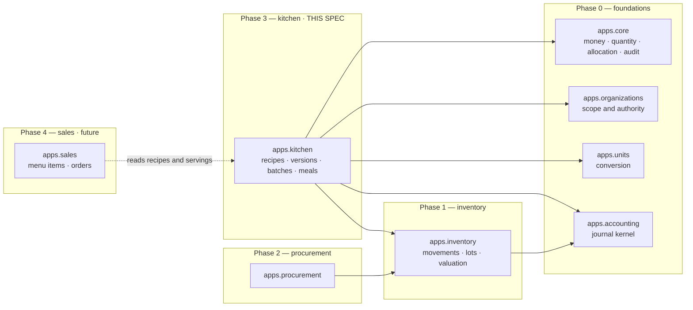

Every arrow points away from `apps.kitchen` except Phase 4's. Nothing imports
the kitchen today, and the link model of §11.2 does not change that: it holds
keys into inventory, and inventory never learns it exists.

### 21.2 Recipe and version structure

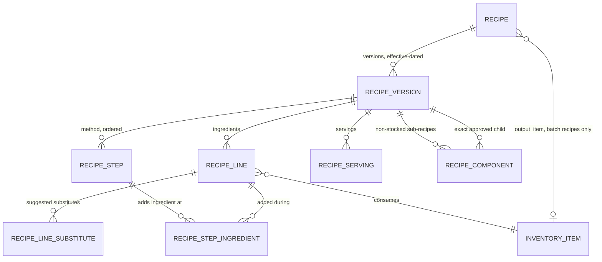

Everything hangs off the **version**, never off the recipe: that is what makes
approval freeze a complete, self-consistent object.

### 21.3 The nested recipe graph

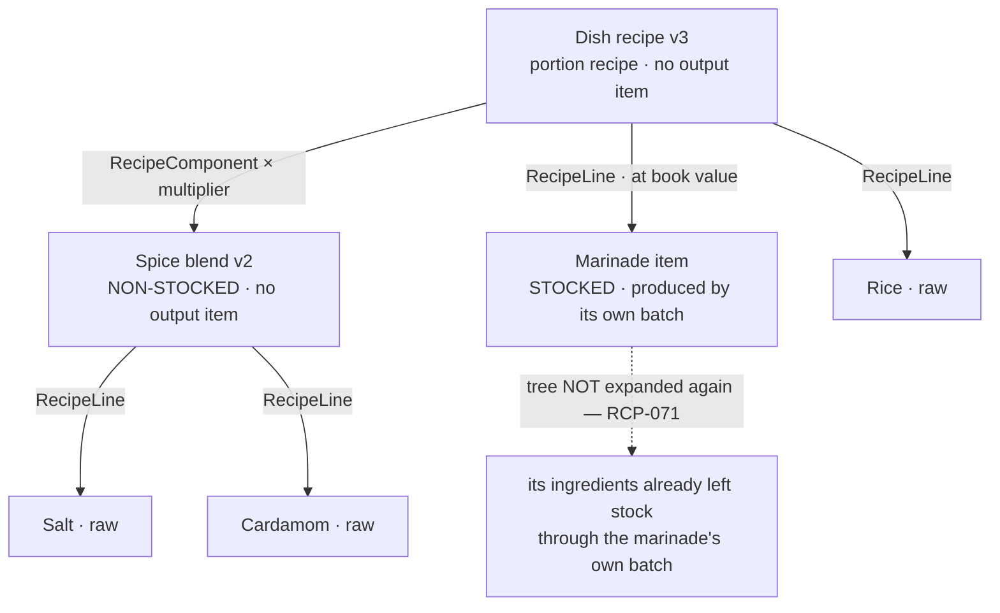

And the shape that is refused, checked on every draft save and again at
approval (RCP-076):

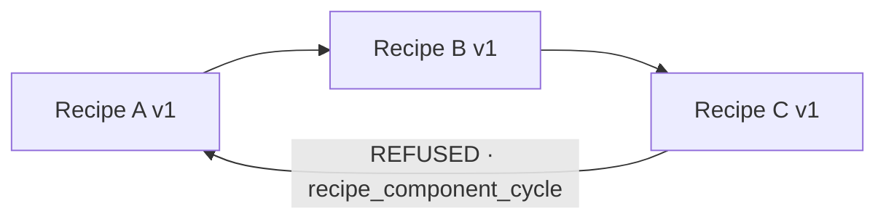

### 21.4 Production batch lifecycle

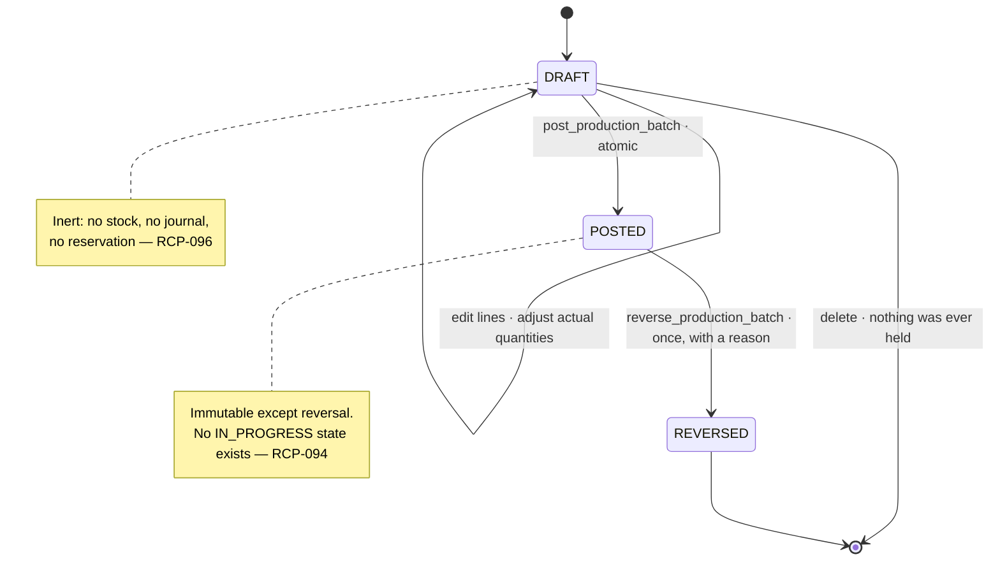

### 21.5 Material and value flow through one batch

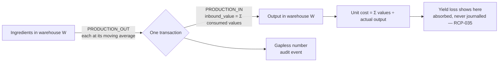

Value in equals value out, exactly. The only thing yield changes is the
denominator.

### 21.6 Stocked semi-finished flow — two batches, two days

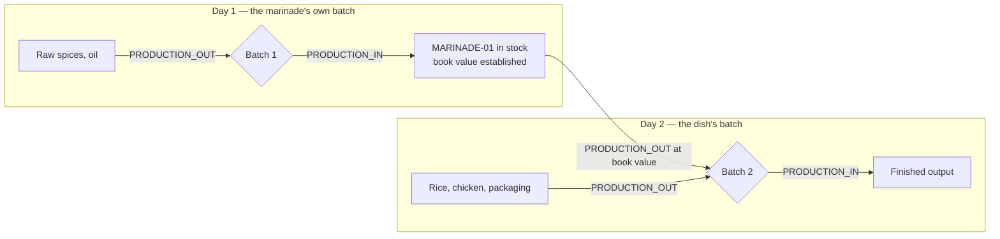

The marinade's ingredients are charged **once**, on day 1. Day 2 charges the
marinade, not the spices that became it.

### 21.7 Non-stocked component flow — one batch, no intermediate stock

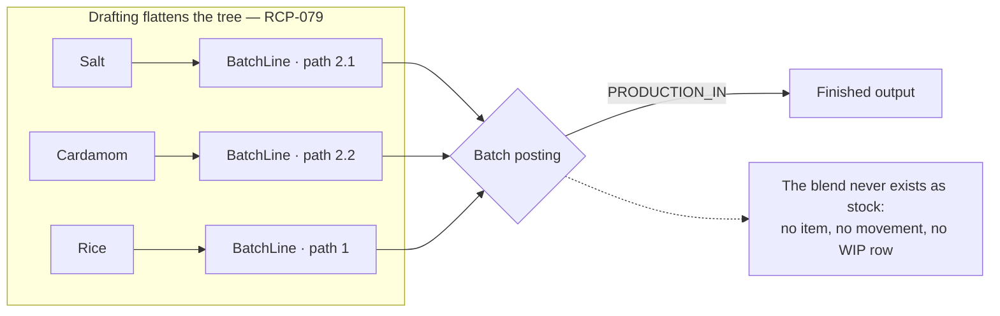

### 21.8 The batch journal, including the silence

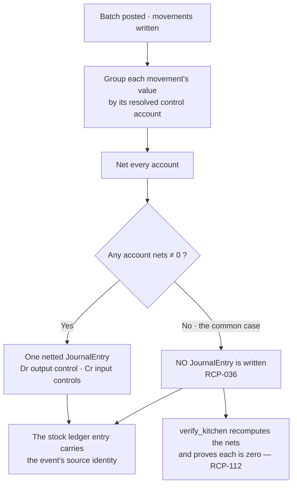

The right-hand branch is not an error path. It is the ordinary path, and the
verifier is what keeps "correctly silent" distinguishable from "wrongly
missing".

### 21.9 Source identity and reversal

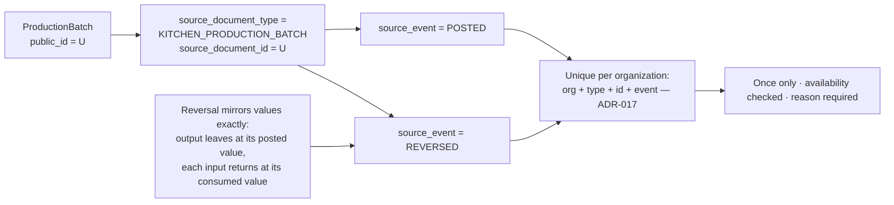

### 21.10 Future Sales integration

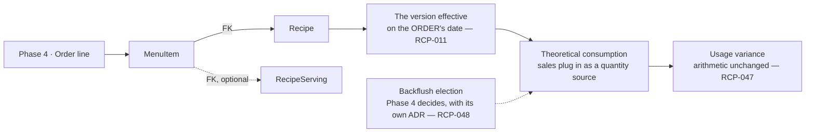

Phase 3 builds none of the dotted boxes. It builds the calculators so that
Phase 4 supplies a quantity source and nothing else has to move.

---

## 22. Blocking decision register

Classifications are limited to: **RESOLVED BY SOURCE**, **RESOLVED BY CERTIFIED
ARCHITECTURE**, **RECOMMENDED DECISION**, **REQUIRES OWNER DECISION**,
**DEFERRED**.

| ID | Question | Classification | Recommendation | Owner decision | Blocks | Default if unanswered | Evidence / source |
|---|---|---|---|---|---|---|---|
| KD-01 | Where is the authoritative SRS? | **DEFERRED** | Supply it; every `RCP-*` is then mapped or corrected | ☐ | Nothing in Phase 3 | Proceed on charter + ADRs + certified code, as Phases 1 and 2 did | S-1; Task 1.0 §0; Task 2.0 §0 |
| KD-02 | When will a **filled and signed** `KM-RCP-004` exist? | **REQUIRES OWNER DECISION** | Fill and sign it for the 19 items before Task 3.10 | **✔ §22.1** | **Task 3.10 acceptance** (not its code) | Phase 3 ships with `DEMO`-namespaced recipes only, described as fiction | S-2: every quantity, cost, code, date and signature blank |
| KD-03 | Does a separate Arabic **method** book exist? | **RESOLVED BY SOURCE** | — | — | — | — | S-3: `كتاب وصفات المطبخ خان مندي.pdf`, 44 pages, 23 recipes with numbered steps, durations and equipment (§24.2). Steps import at Task 3.10 with page provenance (RCP-119) |
| KD-04 | What serving vocabulary is in use? | **RESOLVED BY SOURCE** | Use the register's own terms | — | — | — | S-4: `حبة كاملة`, `نصف حبة`, `حصة`, `طبق`, `فخذ`, `كتف`, `ضلوع`, `رقبة`, plus the plate cards' component grams |
| KD-05 | Is a half **a serving of the whole recipe**, or **its own recipe**? | **RESOLVED BY SOURCE** + certified model | — | — | — | — | **Both, at different layers** (§5C.4). Physical: 1 whole = 2 halves, exact (book p1, p10, p12, p23). Commercial: the plates are separate recipes and do not scale — 1,300 g rice against 700 g (cards 2, 3). RCP-123, RCP-124 |
| KD-06 | Do any items sell as **350 g / 500 g**? | **RESOLVED BY SOURCE** | — | — | — | — | **Yes.** 350 g مندي portion (book p1); 500 g pieces for مدفون, حنيذ, مزموم and رقبة (book p10, p12, p23, p14) and on ten plate cards. §24.3 lists every weight found — including 1 kg, 1.5 kg and 2 kg cuts. **No general "all meat is X" rule exists and none is asserted** |
| KD-07 | Does the branch work in named **kitchen stations**? | **REQUIRES OWNER DECISION** | Confirm before creating a station table | **✔ §22.1** | Nothing — additive either way | **No** — `station` stays null and `KitchenStation` is not created | §5A.2; no source mentions stations |
| KD-08 | Maximum **sub-recipe nesting depth**? | **RECOMMENDED DECISION** | 3 | **✔ §22.1** | Nothing | **3**, enforced as a named constant with a named error | RCP-077; four levels is almost always a modelling error |
| KD-09 | Do batches ever remain **physically in progress across business dates or periods**? | **REQUIRES OWNER DECISION** | No — atomic same-day production | **✔ §22.1** | **Task 3.5, if the answer is YES** (RCP-097) | **NO** — atomic, same-day, one warehouse is the approved Release 1 constraint | §8A; RCP-094's seven conditions |
| KD-10 | Single output per batch, or **multiple**? | **RECOMMENDED DECISION** | Single for Release 1; recovered material gets its own batch | **✔ §22.1** | Nothing | **Single**; multi-output deferred until an allocation basis is approved | RCP-110, RCP-111; §16.3 |
| KD-11 | **Staff-meal expense reclassification** — journal shape and expense role? | **DEFERRED** | A named later task; records accumulate from day one | ☐ | Nothing in Phase 3 | No reclassification; every meal surface carries RCP-108 | RCP-044, RCP-108 |
| KD-12 | Will Phase 4 elect **backflush** consumption? | **DEFERRED** | Phase 4 decides, in writing, with its own ADR | ☐ | Nothing in Phase 3 | Manual kitchen issues remain the actual-consumption source | RCP-048; charter's "explicit simplification" clause |
| KD-13 | Which **price list is authoritative**, and is `أسعار بلي` a delivery channel? | **REQUIRES OWNER DECISION** | Confirm before any margin is computed anywhere | **✔ §22.1** | **Phase 4 margin reporting** | Phase 3 stores no price and computes no margin (RCP-089) | §20.2; cover sheet `مرجع السعر · أسعار بلي`; 23,000 vs 25,000 |
| KD-14 | **Kitchen overhead** allocation basis? | **DEFERRED** | Phase 5 / 7, with an approved basis | ☐ | Nothing in Phase 3 | Not allocated; not shown | §20 component 8 |
| KD-15 | **Labour, gas, utilities** allocation basis? | **DEFERRED** | Phases 5 and 6, each with an approved basis | ☐ | Nothing in Phase 3 | Not allocated; not shown | §20 components 5 – 7 |
| KD-16 | **Output expiry / shelf life** policy? | **RECOMMENDED DECISION** | The output item's `shelf_life_days` from the batch's business date | **✔ §22.1** | Nothing | As recommended | RCP-038; Phase 1's lot model already carries it |
| KD-17 | Loss per **ingredient line** as well as per version? | **RESOLVED BY SOURCE** | Both, with the line rate informational | — | — | — | S-2: `فاقد %` is a column on every ingredient row |
| KD-18 | Is **packaging** separated from food cost? | **RESOLVED BY SOURCE** | Yes, by a line-level cost class | — | — | — | S-8: `كلفة الغذاء` and `كلفة التغليف` are separate totals |
| KD-19 | What converts a sauce **كاسة** to the plate's **grams**? | **REQUIRES OWNER DECISION** | Agree a cup-to-gram figure per sauce, or standardise the cup | **✔ §22.1** | **Task 3.10 data** for the two sauces only | Sauces import in their recipe unit; the plate line stays in grams and the two are **not** reconciled — the sub-recipe link is left unset rather than set wrongly | §24.4, §24.6 C-1/C-2: دقوس yields 80 ml cups, plates consume 125 g |
| KD-20 | Who documents the appetizer **`خلطة`** recipes? | **REQUIRES OWNER DECISION** | Capture the five blends from the chef, as recipes | **✔ §22.1** | **Task 3.10 data** for five appetizers | The five blends are master-data items with no recipe; their appetizer plates cost only what the blend costs as bought | §24.5: cards consume `250 غ خلطة`, no source documents any blend |

**Counts, recalculated by Task 3.0B.** Twenty rows.

| Classification | Count | Rows |
|---|---|---|
| **REQUIRES OWNER DECISION** | **6** | KD-02, KD-07, KD-09, KD-13, KD-19, KD-20 |
| **RECOMMENDED DECISION** | 3 | KD-08 (depth 3), KD-10 (one primary output), KD-16 (shelf life from the batch business date) |
| **DEFERRED** | 5 | KD-01, KD-11, KD-12, KD-14, KD-15 |
| **RESOLVED BY SOURCE** | 6 | KD-03, KD-04, KD-05, KD-06, KD-17, KD-18 — KD-05 jointly with the certified model |
| | **20** | |

**Superseded by the owner's approval of 2026-08-16.** All six rows that required
an owner decision have been answered, and the three recommendations confirmed —
see §22.1. The live count is now:

| State | Count | Rows |
|---|---|---|
| **Answered by the owner** | 9 | KD-02, KD-07, KD-08, KD-09, KD-10, KD-13, KD-16, KD-19, KD-20 |
| **Resolved by source** | 6 | KD-03, KD-04, KD-05, KD-06, KD-17, KD-18 |
| **Deferred to a later phase** | 5 | KD-01, KD-11, KD-12, KD-14, KD-15 |
| **Requiring an owner decision** | **0** | — |

The classification column above is left as it stood when each question was
raised, because it records what *kind* of answer the question needed. The
`Owner decision` column records that the answer arrived.

Task 3.0A left seven open. Task 3.0B closed **KD-03, KD-05 and KD-06** against
the recipe book and plate cards, and opened **KD-19 and KD-20**, which are gaps
the new sources revealed rather than questions they failed to answer — the sauce
unit mismatch and the undocumented appetizer blends. Net six.

The prompt's expectation was that KD-02, KD-07, KD-09 and KD-13 would remain.
They do, unchanged and for unchanged reasons. The two additions are recorded
rather than folded in, because a source that answers three questions and raises
two has done exactly what a good source does.

### 22.1 Owner decisions, recorded 2026-08-16

The owner approved this specification and answered every open row. The answers
are reproduced verbatim in substance; the **Consequence** column is this
document's reading of what each one binds, so that a later reader can tell an
owner's decision from a specification's inference.

| ID | Owner decision | Consequence |
|---|---|---|
| **KD-02** | Real recipe records may be captured as **DRAFT**, but a real branch recipe **cannot be approved or activated until its `KM-RCP-004` costing/approval data is complete** | The data gate stands, moved to the approval boundary rather than the capture boundary. Task 3.1 may hold real recipes as drafts; RCP-125's condition 9 now binds **Task 3.2's approval command**, not Task 3.10's import |
| **KD-07** | **No `KitchenStation` master in Task 3.1.** Station remains nullable | RCP-064's station stays a nullable field. No station table, no station screen, no station permission |
| **KD-09** | **Atomic same-business-date, one-warehouse production.** No partial or multi-day WIP in Release 1 | §8A's seven conditions are approved as written. RCP-097's YES branch does not fire; Task 3.5 is unblocked. No WIP account, no `IN_PROGRESS` state |
| **KD-13** | **Selling prices and sales margins are outside Phase 3** | RCP-089 and RCP-115 confirmed. No price field anywhere in `apps.kitchen`; `أسعار بلي` needs no resolution for Phase 3 to proceed |
| **KD-19** | **No automatic mass-to-volume conversion** between sauce recipe yields and plate quantities without a sourced density or explicit measured conversion | The 80 ml ↔ 125 g gap (§24.6 C-1, C-2) stays open as *data*. The unit layer refuses the conversion rather than guessing it, and the sub-recipe link is left unset — exactly the default the register proposed |
| **KD-20** | An **undocumented prepared mix remains unresolved DRAFT data** and cannot be approved as a sub-recipe | The five appetizer `خلطة` blends may exist as draft rows. They may not be approved, and nothing may treat them as costed sub-recipes until a recipe documents them |

The three standing recommendations were approved as recommended:

| ID | Approved value |
|---|---|
| **KD-08** | Maximum sub-recipe nesting depth = **3** |
| **KD-10** | **One primary batch output** per production batch |
| **KD-16** | Output expiry uses `InventoryItem.shelf_life_days` from the **batch business date** |

**Register state after approval: zero rows require an owner decision.** KD-01
(the absent SRS) remains DEFERRED, as it has since Task 1.0 — it blocks nothing
and never has. KD-11, KD-12, KD-14 and KD-15 remain DEFERRED to their own later
phases.

**What is actually blocked.** **No decision blocks Task 3.1.** Every model shape
above is deliberately agnostic to the open questions — servings support both
whole/half shapes, the station field is nullable, the depth limit is a
constant — so recipe master data can be built the moment this specification is
approved. **KD-09 blocks Task 3.5 only if the answer is YES.** KD-02, KD-19 and
KD-20 block the **acceptance of Task 3.10's real data**, never its code, and
KD-19 and KD-20 block only the two sauces and five appetizers they name. KD-13
blocks Phase 4 margin reporting. That distribution is intentional: an open
question should stop the work it actually governs and nothing else.

---

## 23. Task 3.0A — compliance matrix and amendment log

### 23.1 What the original Task 3.0 prompt actually said

The instruction that produced commit `8ef3685` was, in full and verbatim:

> Task 3.0 — Recipes and Production Domain Specification

Fifty-four characters. It named no sections, so there is no list of requested
sections to check the first draft against, and inventing one retrospectively
would be dishonest. What the first draft was actually measured against — and
what it largely met — was the **standing Task *X*.0 contract** established by
Task 1.0 and Task 2.0: source review, scope boundary, models, requirements with
identifiers, invariants, permissions, reports, source identity, deliberate
omissions, task breakdown, proposed ADRs.

The gaps were real all the same, and they were of two kinds. The first draft
**never opened `KM-RCP-004`** — the file was not in the repository and its
existence outside it was never checked — so it wrote a recipe specification
without reading the kitchen's own approved recipe form. And it transcribed the
charter's consumption formula faithfully instead of asking whether the formula
could be implemented against this system's documents; it cannot (§11.1). Task
3.0A corrects both, plus the material Task 3.0A itself enumerates.

### 23.2 Compliance against the charter's Phase 3 scope

The charter's fifteen bullets (lines 575–595) are the nearest thing to an
authoritative section list that exists.

| Charter bullet | Where | Status |
|---|---|---|
| Recipe versions | §4, §5B | **Complete** |
| Batch recipes | §3 (RCP-007), §7 | **Complete** |
| Portion recipes | §3 (RCP-007), §5C | **Complete** |
| Preparation and production batches | §7, §8, §8A | **Complete** |
| Yield and loss | §9, RCP-060, §19.2 | **Complete** |
| Kitchen issues and returns | §1 (RCP-001) — Phase 1 documents, reused | **Complete by reuse** |
| Waste | §1, RCP-105 — Phase 1 document, classified by what was lost | **Complete by reuse** |
| Staff meals | §10, RCP-108 | **Complete for Release 1**; reclassification **deferred** (KD-11) |
| Complimentary meals | §10, RCP-108 | **Complete for Release 1**; reclassification **deferred** (KD-11) |
| Theoretical consumption | §11.4 (RCP-047) | **Complete**, coverage labelled — sales absent until Phase 4 |
| Actual consumption | §11.2, §11.3 | **Complete, and corrected** — the charter's formula is departed from, with ADR-026 |
| Usage variance | §11.4 (RCP-048), §12 | **Complete** |
| Plate cost | §6 (RCP-023), §5C | **Complete**, extended to cost per serving |
| Historical cost snapshot | §6 (RCP-025, RCP-026) | **Complete** |
| Menu-item mapping | §3 (RCP-010), RCP-091, §21.10 | **Deliberately minimal** — Phase 4 owns `MenuItem`; Phase 3 supplies the stable handles |

Charter attributes named in Part 1 §6 and handled outside those bullets:
optional ingredients (RCP-021), substitute ingredients (RCP-022), by-products
(RCP-111), approval status (RCP-013), branch applicability (RCP-017),
effective dates (RCP-011), preparation loss and cooking yield (RCP-018,
RCP-060), notes and preparation instructions (§5A).

### 23.3 Compliance against Task 3.0A's sections

| § | Requested | Where it now lives | Status | Correction made |
|---|---|---|---|---|
| **A** | Recover state; compliance matrix | §23; state recorded in the runbook | **Complete** | Confirmed branch `phase/3-kitchen`, clean tree, `8ef3685` pushed, no Task 3.1 code, local `main` untouched. Recorded the one surprise: the owner merged PR #3 into `origin/main` as `aedaa6b`, so `8ef3685` is already on `main` — which is why no RCP identifier was renumbered |
| **B** | Formal source audit | §0, S-1 – S-13 | **Complete** | **Found `KhanMandiRecipe.xlsx` outside the repository and read all 23 sheets.** Recorded honestly that the SRS and a separate method book remain unreviewed because they do not exist. Added RCP-058 (data gate) and RCP-059 (no invented figures) |
| **C** | Structured recipe steps | §5A, RCP-063 – RCP-069 | **Complete** | Added `RecipeStep` and `RecipeStepIngredient` with all thirteen requested attributes, plus delivery, import columns, demo and test obligations. Free-text `instructions` demoted to an overview. Temperature and duration null unless sourced |
| **D** | Nested recipes and sub-recipes | §5B, RCP-070 – RCP-081, §21.3 | **Complete** | Stocked vs non-stocked made **mutually exclusive by construction** (RCP-070), which is what prevents double counting. Cycle rejection on every draft save, bounded depth, recursive roll-up, flattening with `component_path`, exact child-version references |
| **E** | Recipe servings and output conversions | §5C, RCP-082 – RCP-091 | **Complete** | `RecipeServing` with `factor_of_batch` and `relative_factor` both named; cost per serving as a 6 dp rate; batch cost split by `apps/core/allocation.allocate` so the sum is exact to the fils; no dish, cut or gram figure in any service, with a convention test |
| **F** | Restaurant worked scenarios | §19.1 – §19.4 | **Complete** | All four scenarios, entirely symbolic. Scenario 1 carries the workbook caveat that a half is currently its own card, not a 0.5 factor |
| **G** | Profitability boundary | §20, RCP-115, RCP-116 | **Complete** | Twelve components with owner module, source, basis, phase and standard-vs-actual; three named margins; the 23,000 figure labelled illustrative against the workbook's 25,000; the `أسعار بلي` channel-price risk recorded |
| **H** | Actual-consumption correction | §11, RCP-098 – RCP-107 | **Complete** | RCP-046 formally amended, its withdrawn text preserved. Two reports, an exhaustive movement partition, the stock identity as the proof, `BatchDocumentLink` kitchen-owned, output waste kept out of ingredient consumption |
| **I** | Release 1 WIP and atomic batch policy | §8A, RCP-094 – RCP-097 | **Complete** | Seven enumerated conditions, refusal rather than misrepresentation, and KD-09 with the full list of what a YES would require |
| **J** | Journal decision | §8 unchanged; RCP-112, RCP-113 added | **Complete** | Decision retained; added the verifier obligation to prove the nets really are zero, and three explicit Task 3.5 test obligations for the no-journal case |
| **K** | Staff and complimentary meals | §10, RCP-108 | **Complete** | Memo-only retained; a table of what the record does and does not do; every surface carries the statement; reclassification named as a deferred task with KD-11 |
| **L** | Multi-output and servings | §16A, RCP-109 – RCP-111 | **Complete** | Servings explicitly excluded from the multi-output restriction; the test for genuine multi-output stated as "two items receive stock from one input pool"; by-products cannot be activated by data alone |
| **M** | Mermaid diagrams | §21.1 – §21.10 | **Complete** | All ten, plus the rejected-cycle figure. The first diagrams in the repository |
| **N** | Blocking decision register | §22, KD-01 – KD-18 | **Complete** | Eighteen rows, all five classifications used, a default for every one, and an explicit statement of what is and is not blocked |
| **O** | Update companion documents | §23.4 | **Complete** | Six files; invariants extended to 46; breakdown rewritten for the new ownership; traceability extended to RCP-116 |
| **P** | Validation | Runbook | **Complete** | Traceability tests, ruff, format, `manage.py check`, `makemigrations --check`, pre-commit — results recorded |
| **Q** | Commit and stop | `docs(recipes): complete Task 3.0 domain gaps` | **Complete** | Pushed to `phase/3-kitchen`. `main` not merged. Task 3.1 not started |

Nothing is classified Partial or Missing, and nothing is deferred **as a
section**. What is deferred is business scope — reclassification, backflush,
multi-output, overhead allocation — each with a register row, a default and a
reason.

### 23.4 Amendment log

| File | Change |
|---|---|
| `docs/tasks/task-3-0-recipes-production-domain-spec.md` | §0 replaced by the source audit; §5 gained three fields; §5A, §5B, §5C, §8A, §16A and §19 – §23 added; §11 rewritten with RCP-046 amended in place and its withdrawn text preserved; §6, §10, §12, §17, §18 extended. RCP-058 – RCP-116 added; **no identifier renumbered** |
| `docs/invariants/kitchen-invariants.md` | Invariants 31 – 46 added, covering steps, components, servings, the consumption partition, attribution limits, the Release 1 boundary and the provably-silent journal; three deliberate non-invariants added |
| `docs/tasks/phase-3-task-breakdown.md` | Task 3.1 – 3.11 ownership and exit criteria rewritten for the new material; KD dependencies recorded on 3.1, 3.5 and 3.10 |
| `docs/requirements/traceability.md` | Phase 3 section extended from 57 rows to 116, all `Specified` |
| `docs/decisions/README.md` | ADR-024 and ADR-025 scope updated; ADR-026 registered as proposed |
| `docs/runbooks/overnight-progress.md` | Task 3.0A checkpoint, with the workbook finding and the validation results |

### 23.5 Requirement index

**RCP-001 – RCP-126**, contiguous, no gaps and no reuse. RCP-001 – RCP-057 are
Task 3.0's and are unchanged except RCP-046, which is amended in place with its
original text quoted. RCP-058 – RCP-116 are Task 3.0A's, unchanged by Task 3.0B
except RCP-090, whose "owner chooses" clause now points at the answer §5C.4
gives. RCP-117 – RCP-126 are Task 3.0B's.

| Range | Subject |
|---|---|
| RCP-001 – RCP-005 | Event kinds; the app boundary |
| RCP-006 – RCP-010 | The recipe |
| RCP-011 – RCP-017 | Versions, effective dating, approval |
| RCP-018 – RCP-022, RCP-060 – RCP-062 | Lines, loss, cost class, measured vs approved |
| RCP-023 – RCP-027, RCP-092, RCP-093 | Costing, snapshots, the class split |
| RCP-028 – RCP-033 | Batches |
| RCP-034 – RCP-040 | Posting, valuation, the journal |
| RCP-041, RCP-042 | Yield and variance reads |
| RCP-043 – RCP-045, RCP-108 | Meals |
| RCP-046, RCP-098 – RCP-107 | Consumption, corrected |
| RCP-047, RCP-048 | Theoretical consumption; the backflush deferral |
| RCP-049, RCP-050, RCP-112, RCP-113 | Reconciliation and its proofs |
| RCP-051 – RCP-053 | Permissions and scope |
| RCP-054 – RCP-059 | API, UI, demo, and the recipe-data gate |
| RCP-063 – RCP-069 | Steps |
| RCP-070 – RCP-081 | Nested sub-recipes |
| RCP-082 – RCP-091 | Servings |
| RCP-094 – RCP-097 | The Release 1 production boundary |
| RCP-109 – RCP-111 | Servings versus co-products |
| RCP-114 – RCP-116 | Worked examples and the profitability boundary |
| RCP-117 – RCP-126 | The three sources, provenance, the two layers, the data gate |

### 23.6 Task 3.0B — compliance against its own sections

| § | Requested | Where it now lives | Status | Correction made |
|---|---|---|---|---|
| **A** | Recover state | Runbook; §23.6 | **Complete** | Branch `phase/3-kitchen`, tree clean, `dd02d98` pushed, no stashes, no `apps/kitchen`, local `main` untouched at `7073f95` |
| **B** | Locate and read the recipe book | §0 S-3, §24.1 | **Complete** | Found at the stated path. Recorded path, **44 pages** and SHA-256. Also found **two decks nobody named** — S-14 and S-15 — and read them too. Page count verified independently: the harness reported 13/569/117, the files' own page trees say **44/35/10**, and 44/35/10 is correct |
| **C** | Full page-by-page audit | §24.2 – §24.6 | **Complete** | 23 recipes, 35 main plates, 10 appetizers, every serving weight, all three yields, eight conflicts, three unresolved fields. Both claims retained wherever the sources disagree (RCP-121) |
| **D** | Correct KD-03 | §22 KD-03; RCP-068 | **Complete** | **RESOLVED BY SOURCE.** Thirteen sourced durations tabulated. `temperature_c` stays null — the book gives heat *instructions*, never a number, and inventing Celsius to fill the column would be the exact failure RCP-068 exists to prevent |
| **E** | Correct KD-06 | §22 KD-06; §24.3 | **Complete** | **RESOLVED BY SOURCE.** 350 g مندي portion and 500 g neck confirmed on their pages, plus every other weight in the three documents. **No general "all meat is 500 g" rule asserted** — ضلوع is 1 kg, كتف 1,500 g, فخذ 2 kg |
| **F** | Correct KD-05 | §5C.4; §22 KD-05 | **Complete** | Two-layer rule. Physical conversion exact; commercial assembly **not** proportional — proven from cards 2 and 3, where rice runs 700 g against 1,300 g. RCP-123, RCP-124 |
| **G** | Recipe book versus approval workbook | §0.3; RCP-117, RCP-118 | **Complete** | Three sources, three layers, one boundary. Imports land `DRAFT`; the PDFs cannot approve anything because they carry no signature, date, cost or code. **KD-02 deliberately left open** |
| **H** | Task 3.10 data gate | §14A; RCP-125, RCP-126 | **Complete** | All ten conditions, each with the failure it prevents. RCP-122 keeps the PDFs out of the runtime |
| **I** | Update the decision register | §22 | **Complete** | Recalculated, not assumed: **6** open, and the four the prompt predicted (KD-02, KD-07, KD-09, KD-13) are among them. KD-19 and KD-20 added — gaps the new sources revealed. Recommended defaults for KD-08, KD-10 and KD-16 unchanged |
| **J** | Update companion documents | §23.7 | **Complete** | Seven files. No RCP renumbered; RCP-117 – RCP-126 added |
| **K** | Validation | Runbook | **Complete** | Traceability tests, ruff, format, `manage.py check`, `makemigrations --check`, pre-commit |
| **L** | Commit and stop | `docs(recipes): reconcile Task 3.0 with recipe book` | **Complete** | Pushed to `phase/3-kitchen`. `main` not merged. Task 3.1 not started. No PDF tracked |

### 23.7 Task 3.0B amendment log

| File | Change |
|---|---|
| `docs/tasks/task-3-0-recipes-production-domain-spec.md` | §0 audit rows S-3 – S-7 rewritten and S-14, S-15 added with file identities; §0.2 corrected; §0.3 added (RCP-117 – RCP-122); §5A RCP-068 amended with thirteen sourced durations; §5C.1 table made source-backed; §5C.4 added (RCP-123, RCP-124); §14A added (RCP-125, RCP-126); §19.1 rescaled to the sourced batch of 40 and its caveat resolved; §19.2 source note corrected; §22 KD-03/05/06 reclassified, KD-19/20 added, counts recalculated; §23.6, §23.7 and §24 added |
| `docs/invariants/kitchen-invariants.md` | Invariants 47 – 52 added: provenance, measurement basis, conflict retention, draft-only import, no cross-plate derivation, PDFs out of the runtime |
| `docs/tasks/phase-3-task-breakdown.md` | Task 3.1, 3.2 and 3.10 ownership updated for provenance, measurement basis and the ten-step gate; KD dependencies corrected |
| `docs/requirements/traceability.md` | Phase 3 section extended to RCP-126, all `Specified` |
| `docs/decisions/README.md` | ADR-024 and ADR-025 scope notes updated for the sourced two-layer rule |
| `docs/runbooks/overnight-progress.md` | Task 3.0B checkpoint with the audit findings and validation results |

---

## 24. Task 3.0B — the source audit of the recipe book and plate cards

Added 2026-08-16 by Task 3.0B, after the owner supplied the three PDFs of S-3,
S-14 and S-15. This section is the **evidence base**: every source-derived claim
elsewhere in this document cites a page here, and everything here cites a page in
the PDFs.

### 24.1 How the audit was taken

The three files are digitally generated PDFs carrying a text layer in
Type0/CID fonts with ToUnicode CMaps. The audit was taken from that text layer,
decoded through each font's own CMap — **not** from a search snippet, a summary,
or an image. All 89 pages were read: 44 + 35 + 10, matching each file's page-tree
`/Count`. Glyph runs are stored in visual order and were reversed to logical
order, with digit runs preserved.

Two things this method cannot do, stated so nobody assumes otherwise: it does
not read text baked into images, and it does not preserve table geometry. Where
a quantity appeared without an ingredient, or an ingredient without a quantity,
it is recorded in §24.6 as unresolved rather than guessed.

### 24.2 The recipe book — 23 recipes across 44 pages

`كتاب وصفات المطبخ خان مندي.pdf`. "Batch scale" is the recipe's own stated
input quantity; **these are pit- and pot-scale figures, not per-plate figures.**

| # | Recipe | Pages | Batch scale as stated | Method | Notable |
|---|---|---|---|---|---|
| 1 | مندي (لحم – دجاج) | 1 | 40 حبة دجاج كاملة + 50 كغ لحم عراقي + 50 كغ تمن + 63 لتر ماء حار | Pit (حفرة), narrative | Carving rule: 350 g نفرات; chicken halved. Note: *"لحم الخروف لا يزيد عن 18 كيلو"* |
| 2 | كبسة اللحم أو الدجاج | 2 – 3 | 10 كغ لحم **أو** 10 حبة دجاج + 20 كغ تمن + 35 لتر ماء | 8 numbered steps | Blender sub-step; 4 min sear, 1 min stir |
| 3 | المضغوط لحم | 4 – 5 | 15 كغ لحم + 15 كغ تمن | 11 numbered steps | 15 min spice toasting; foil seal |
| 4 | المضغوط الدجاج | 6 – 8 | 8 حبات دجاج كاملة + 15 كغ تمن | 11 numbered steps | Same shape as #3, chicken maji instead of meat |
| 5 | المدفون (لحم أو دجاج) | 9 – 11 | 30 حبة دجاج **مع** 40 كغ لحم + 50 كغ تمن + 63 لتر | 13 numbered steps | 500 g pieces; chicken halved; 70 لتر to the rice pot; 3 – 4 h |
| 6 | حنيذ (لحم أو دجاج) | 12 – 13 | 40 كغ لحم + 50 حبة دجاج + 2,000 غ بهارات حنيذ | 9 numbered steps | Pressure cooker: **chicken 90 min, meat 120 min** |
| 7 | رقبة لحم | 14 – 15 | 7 كغ لحم عراقي | 10 numbered steps | **500 g neck pieces**; 4 – 5 h; finished in the oven |
| 8 | زربيان لحم | 16 – 18 | 10 كغ لحم + 8 كغ تمن | 12 numbered steps | Rice soaked 30 min, boiled to **¾ (75%)**, steamed 30 min over charcoal |
| 9 | زربيان دجاج | 19 – 21 | 5 حبة دجاج طازج + 8 كغ تمن | 12 numbered steps | Identical method to #8 |
| 10 | مزموم (اللحم والدجاج) | 22 – 23 | 2.5 كغ لحم + 7 حبة دجاج كاملة | 8 numbered steps | **500 g pieces**; chicken halved; oven 3 – 4 h |
| 11 | ضلوع لحم بدبس الرمان | 24 | 10 كغ ضلع منغ | 6 numbered steps | **Note: وزن الضلع 1 كغ**; marinated 5 – 6 h refrigerated |
| 12 | برم لحم | 25 – 27 | 3 كغ لحم منغ | 8 steps + serving method | Clay jar (فخارة) on charcoal; served with **700 g white rice** |
| 13 | بخاري اللحم | 28 – 29 | 6 كغ لحم منغ + 10 كغ تمن | 13 numbered steps | 17 ingredient lines |
| 14 | بخاري الدجاج | 30 – 31 | 5 حبة دجاج كاملة + 10 كغ تمن | 13 numbered steps | 16 ingredient lines |
| 15 | دجاج الرمان | 32 – 33 | 10 حبة دجاج | Narrative | Separate sauce sub-method; **10 min** on low heat |
| 16 | السمك المشوي | 34 | 10 حبة سمك **بوزن 1,500 – 1,800 غ** | Narrative + serving method | Variable-weight input; charcoal to ¾ الاستواء |
| 17 | الفحسة | 35 | 3 كغ لحم عجل + 1 كغ لحم منغ مع اللية | Narrative | Pressure cooker; 5 min; 15 min |
| 18 | مرق الفاصولياء | 36 – 37 | 15 كغ حب فاصوليا + 1 كغ لحم | Narrative | Soaked overnight; 10 min + 10 min |
| 19 | التبسي | 38 – 39 | 35 كغ بطاطا + 30 كغ باذنجان | Narrative | **Oven 80 min** |
| 20 | السوب | 40 – 41 | 1.5 كغ ضلوع + 1 كغ عظم + 16 لتر مياه | Narrative | Thickened with 2 كغ طحين |
| 21 | الخبز الملوح اليمني | 42 | جونية طحين 50 كغ + 31 لتر مياه | Narrative | **Yield stated** — see §24.4 |
| 22 | السحاوق (الدقوس) | 43 | 100 كغ طماطم + 20 كغ فلفل حار | Narrative | **Yield stated**; a sauce sub-recipe |
| 23 | صلصة لبن الروبة | 44 | 1 لتر لبن : 1 لتر ماء | Narrative | **Yield stated**; a sauce sub-recipe |

**Units observed across the book:** كغ / كيلو, غرام / غ, حبة, لتر, مل, بطل
(1,000 مل), علبة, ملعقة, جونية (50 كغ), كاسة. Every one is a unit
`apps/units` must carry or map before import — the packaging conversions of
ADR-006's "B. Packaging conversion" case, exactly as the charter framed them.

### 24.3 Every source-backed serving and piece weight

This table is the complete answer to KD-06 and the reason it is now closed. It
is exhaustive over the three PDFs — no other weight-per-serving figure appears
in any of them.

| Weight | What it measures | Basis (RCP-120) | Source |
|---|---|---|---|
| **350 g** | مندي meat portion (نفر) | `COOKED` — carved after the pit | Book p1 |
| **350 g + 350 g** | The two rices on رقبة لحم and نصف مضبي plates | `PLATED` | Cards 13, 24 |
| **500 g** | مدفون meat piece before cooking | `RAW` | Book p10 |
| **500 g** | حنيذ meat piece before cooking | `RAW` | Book p12 |
| **500 g** | مزموم meat piece before cooking | `RAW` | Book p23 |
| **500 g** | **رقبة** neck piece | `RAW` | Book p14 |
| **500 g** | The "قطعة لحم … قبل الطبخ" line on ten plate cards | `RAW` | Cards 1, 4, 7, 10, 13, 14, 17, 20, 27, 29 |
| **650 g + 650 g** | The two rices on the whole مضبي plate | `PLATED` | Card 23 |
| **700 g** | Standard single-plate rice | `PLATED` | Cards 1, 4, 7, 10, 12, 14, 16, 17, 19, 20, 22, 24, 26, 27, 29, 30, 32 |
| **700 g** | Half chicken, مضبي, grilled weight | `PREPARED` | Card 24 |
| **700 g** | White rice served beside برم | `PLATED` | Book p26; card 29 |
| **1,000 g (1 كغ)** | One ضلع (rib) | `RAW` | Book p24 note; cards 28, 33 |
| **1,300 g** | Whole-chicken plate rice | `PLATED` | Cards 3, 6, 9, 11, 15, 18, 21, 25, 28, 31, 33 |
| **1,400 g** | **Whole raw chicken** — the chef's note | `RAW` | Cards 2, 3, 5, 6, 8, 9, 11, 12, 15, 16, 18, 21, 22, 25, 26, 31, 32 |
| **1,400 g** | Whole مضبي chicken, charcoal-grilled | `PREPARED` | Card 23 |
| **1,500 g** | كتف piece; and its plate's rice | `RAW`; `PLATED` | Card 35 |
| **1,500 – 1,800 g** | One fish, as purchased | `RAW`, a **range** | Book p34 |
| **2,000 g (2 كغ)** | فخذ piece | `RAW` | Card 34 |
| **2,100 g** | فخذ plate rice | `PLATED` | Card 34 |
| **125 g** | One كاسة of طرشي, دقوس or روبة | `PLATED` | 33 of 35 main cards |
| **150 g** | One كاسة of دقوس and طرشي — **on one card only** | `PLATED` | Card 9 (§24.6) |
| **250 g** | One appetizer خلطة portion | `PLATED` | Appetizer cards 5 – 9 |
| **300 g** | One bread dough piece | `PREPARED` | Book p42 |
| **80 ml** | One كاسة of دقوس, as the sauce recipe measures it | `COOKED` | Book p43 |
| **100 ml** | One كاسة of روبة, as the sauce recipe measures it | `COOKED` | Book p44 |

The 1,400 g raw chicken and the two-halves rule together give the physical
conversion of RCP-123 its numbers: half = 700 g of a 1,400 g bird, and card 24
states that 700 g independently, which is a genuine cross-check rather than an
inference.

### 24.4 The three stated yields — and why they matter more than their size

Three recipes state an explicit output. They are the only yield figures in any
Khan Mandi source, and each is a **sub-recipe consumed by other plates** —
precisely the nested-recipe shape of §5B.

| Recipe | Input | Stated output | Serving | Source |
|---|---|---|---|---|
| الخبز الملوح اليمني | 1 جونية طحين (50 كغ) + 31 لتر ماء | **250 – 270 خبزة** | One bread, ≥ 40 cm diameter, from a 300 g dough piece | Book p42 |
| السحاوق (الدقوس) | 100 كغ طماطم + 20 كغ فلفل حار + كزبرة + 1,800 غ ملح | **180 كاسة** | 80 ml per كاسة | Book p43 |
| صلصة لبن الروبة | 1 لتر لبن + 1 لتر ماء + 7 غ ملح per 2 لتر | **20 كاسة** per 2 لتر | 100 ml per كاسة | Book p44 |

Three observations the design has to answer, and does:

- **The bread yield is a range, not a number.** 250 – 270 from one sack is a
  ±4% band. `expected_output` is a single figure (RCP-031's expected side), so a
  range is recorded as its own field or as the midpoint with the band in the
  note — and the *actual* is measured per batch, which is RCP-031 working
  exactly as intended. A system that stored 260 as a fact would be inventing
  precision the kitchen never claimed.
- **These are batch recipes with `output_item`s** (RCP-007): bread, dقوس and
  روبة are produced in bulk, stocked, and drawn on by plates for days. That
  makes them **stocked sub-recipes** (§5B.1) — a plate consumes them at
  inventory book value and does **not** re-expand their tomato and chilli.
  RCP-070's mutual exclusivity is what keeps the tomatoes from being counted
  twice.
- **The units disagree between layers, and that is the first real import
  problem.** The sauce recipe yields كاسات of **80 ml**; the plate cards consume
  دقوس in grams — **125 g**. The روبة recipe yields 100 ml cups; the plates
  consume 125 g. Neither is wrong: one measures what the kitchen produces, the
  other what lands on a plate. Reconciling them needs a density or an agreed
  cup-to-gram conversion, which is an `apps/units` conversion **and a decision
  nobody has made** — KD-19.

### 24.5 The plate cards — the assembly layer

`كارت الاطباق الرئيسية.pdf`: 35 sellable main plates, one per page. Every card
has the same skeleton — a protein line, a rice line, three side كاسات, optional
garnish lines, an optional chef's note, and a plate preparation time.

| Pattern | Detail |
|---|---|
| Protein | Either "قطعة … 500 غرام قبل الطبخ", or a whole/half chicken, or a named cut (ضلوع 1 كغ, فخذ 2 كغ, كتف 1,500 غ) |
| Rice | 700 g on single plates, 1,300 g on whole-chicken plates, 1,500 g on كتف, 2,100 g on فخذ; split 350+350 or 650+650 where two rices are served |
| Sides | طرشي, صلصة دقوس, روبة — 125 g each, doubled ("عدد 2") on most whole-bird plates |
| Garnishes | Named separately with their own grams: بصل مقلي 10/20 g, جزر مقلي 10 g, زبيب 10 g, دبس الرمان 30 g, شرائح ليمون 50 g, حبوب رمان 5 g, مكسرات 20 g, ثومية 90 g |
| Plate prep time | **10 minutes** on 33 cards; **30 minutes** on the two مضبي cards (23, 24) |
| Chef's note | "وزن الدجاجة الكاملة قبل الطبخ 1,400 غرام" on every chicken card |

`كارت المقبلات.pdf`: 10 appetizers. Five (حمص, باذنجان متبل, جاجيك,
باذنجانية, كشكة) are assembled from a **pre-made 250 g `خلطة`** plus garnishes;
the other five (تبولة, فتوش, جرجير, كينوا, عنب ورق) list raw components
individually, in grams.

**The gap this exposes.** No recipe for any `خلطة` exists in the recipe book.
Five appetizers therefore consume a component that nothing documents how to
produce — the sub-recipe tree has a missing level. This is not a modelling
problem (§5B handles it the moment the blend recipe exists) but it **is** a data
problem, and it is KD-20.

### 24.6 Conflicts and unresolved fields

Per RCP-121 both claims are retained. None of these is resolved here; each is
listed for the chef and accountant to settle in the ordinary approval workflow.

| # | Conflict or gap | Claim A | Claim B | Assessment |
|---|---|---|---|---|
| C-1 | Sauce serving unit | دقوس yields كاسات of **80 ml** (book p43) | Plates consume **125 g** دقوس (33 cards) | Different layers; needs a cup-to-gram conversion. **KD-19** |
| C-2 | Yoghurt serving unit | روبة yields كاسات of **100 ml** (book p44) | Plates consume **125 g** روبة | Same as C-1 |
| C-3 | Side size on one plate | 125 g on 33 cards | **150 g** دقوس and طرشي on مضغوط دجاج كاملة (card 9) | Likely a typo, possibly deliberate. Import both; chef decides |
| C-4 | Sides not doubled | Whole-bird plates double their sides | **كبسة دجاج كاملة (card 6) does not** — 125 g × 1 of each | Isolated exception; must not be "corrected" by an importer (RCP-121) |
| C-5 | Half card names a whole bird | Card 22 is titled حنيذ دجاج **نصف** حبة | Its line 1 reads **"دجاجة كاملة حنيذ"** | Almost certainly a copy error in the source. Flag, do not silently fix |
| C-6 | Item universes differ | Workbook: **19** items | Cards: **35** main + 10 appetizers; book: **23** recipes | Three different scopes. The workbook's 19 are the costed subset; مضبي, برم, فحسة, كبسة and دجاج بدبس الرمان appear on cards but not in the workbook |
| C-7 | طبق خان مندي | Workbook item 8, 35,000 IQD, class طبق مشترك | **No plate card and no recipe** | A sold item with no documented composition |
| C-8 | Whole-chicken price | Workbook: **25,000** | The 23,000 used illustratively in §20 | §20's figure was always labelled illustrative; it is **not** a Khan Mandi price. KD-13 unchanged |

Unresolved fields inside the sources themselves:

- **Coriander quantity** in السحاوق (book p43) — the unit `كغ` is present, the
  number is not. Import must leave it blank, not guess.
- **بهارات صحيحة** in بخاري اللحم (book p28, line 3) — named with no quantity.
- **Every** `كمية القياس`, `الكمية المعتمدة`, `فاقد %`, `كلفة الوحدة`,
  `كلفة المكون`, `رمز الصنف`, `يعتمد من تاريخ` and signature in the workbook
  (S-2) — still blank. **KD-02 is unchanged by Task 3.0B**: the method and
  assembly layers are now sourced, and the costing layer still is not.

### 24.7 What Task 3.0B changed in the model

Nothing structural. Every shape specified by Task 3.0 and Task 3.0A survived
contact with the real documents, which is the outcome a specification wants from
its first encounter with evidence. What changed is the **grounding**:

| Before Task 3.0B | After |
|---|---|
| KD-03 open — no method book found | **Resolved by source**: 44 pages, 23 recipes, numbered steps, durations, equipment |
| KD-05 open — whole vs half a binary choice | **Resolved by source** as two layers: exact physical conversion, non-proportional commercial assembly (RCP-123, RCP-124) |
| KD-06 open — no gram servings believed to exist | **Resolved by source**: 350 g, 500 g, 1 kg, 1.5 kg, 2 kg and more, all listed in §24.3 |
| Servings table carried illustrative figures | Every row source-backed and page-cited (§5C.1) |
| Assembly layer entirely unknown | 45 plate cards read; portion recipes now have a real shape (§24.5) |
| No provenance on imported data | RCP-119 — `source_document` and `source_page` on every imported row |
| Quantities compared freely | RCP-120 — `measurement_basis`, because 350 g cooked and 500 g raw are the same meat |

---

## 25. Task 3.2A — what the lifecycle settled, and where it departed

Task 3.2A implemented the approval boundary: submission, four-party review
evidence, maker-checker approval, explicit activation, effective-dated branch
scope, database overlap enforcement, the resolver, supersession and whole-row
immutability. `ADR-024` is now **written and accepted** and carries the
reasoning; this section records only what the specification itself has to be
corrected or extended to say.

### 25.1 The lifecycle vocabulary, extended

§4 named `DRAFT → APPROVED → SUPERSEDED`, with `DISCARDED` for drafts. That is
the *shape* of the lifecycle and it survived. Two states were added and one was
dropped, and both changes are recorded here rather than made silently.

| State | Status | Why |
|---|---|---|
| `DRAFT` | as specified | — |
| `SUBMITTED` | **added** | §4 assumed approval happened to a draft. It cannot: reviews recorded against a document the author is still editing prove nothing about the document that eventually gets approved, and the workbook's three signatures are three people reading *the same page*. Submission is what freezes the page |
| `APPROVED` | as specified | — |
| `ACTIVE` | **added** | §4 folded "agreed" and "in force" into one state. The owner's KD-02 amendment separated them — a real recipe may be captured, and may not be *approved or activated* — and RCP-011's date resolution needs a state that carries a range. Approval is agreement; activation is the claim on a date |
| `REJECTED` | **added** | §4 had no way to record a refusal. A version somebody would not sign is evidence, and deleting it leaves the next reader wondering why version 3 exists |
| `SUPERSEDED` | as specified | — |
| `EXPIRED` | **not created** | §4 names one terminal state and this follows it. Expiry is a fact about a date, not a state a row sits in: a stored `EXPIRED` needs a clock-driven job, and on every morning that job did not run the status and the range would disagree about the same version. `RecipeVersion.is_expired_on()` derives it |
| `DISCARDED` | **not created** | Discarding a draft deletes the row — nothing outside a draft may reference one — and the audit event carries the identity forward. A status nothing ever reaches would be a lie in an enum |

**RCP-127.** The lifecycle is six states and one terminal state. No status is
stored that depends on the current date, and no status exists that no command
reaches.

### 25.2 The four signatures, and which separations are real

§0.1 read `الكمية المعتمدة` as *"الشيف + المحاسب + المدير"* and §14A's
conditions 6 – 8 turned that into three reviews. The signature page carries a
fourth line for the store, so `RecipeVersionReview` has four types:
`KITCHEN`, `STOREKEEPER`, `ACCOUNTING` and `FINAL`.

**RCP-128.** **No global `CHEF` role is created.** The four are responsibilities
exercised on one document, not posts in the organization chart. They are review
types carried by whichever role holds `review_recipe_version`, and adding a role
to the whole ERP's access model to record one column of one kitchen form would
misrepresent both.

**RCP-129.** The separations enforced are exactly those the source describes:
the approver is never the author, never the submitter and never any reviewer;
and the kitchen and costing reviews are given by two different people. The
store's review is deliberately **not** forced apart from the kitchen's — in a
small branch the person who knows the cut is the person who knows the sack, and
inventing a separation the source does not claim would be as wrong as dropping
one it does.

### 25.3 Organization-wide effective scope is materialised

§4's `branches M2M, empty = every branch` stays true of `Recipe` — that is a
statement about where a *dish* is cooked, and no constraint depends on it.

It cannot be true of a **version's effective scope**. A row claiming *all
branches* and a row claiming *branch B* overlap, and RCP-012's exclusion
constraint cannot see that, because there is nothing to compare branch B
against.

**RCP-130.** An organization-wide activation writes one
`RecipeVersionBranchScope` row per applicable branch and records that it did so
in `is_organization_wide` — provenance, not a scope modifier. Overlap then
becomes a question about two ordinary rows, and
`EXCLUDE USING gist (recipe, branch, daterange)` makes ambiguity
unrepresentable rather than merely unlikely.

**Consequence, stated because it is the one an operator will meet.** A branch
created after a version was activated has no scope row, and the recipe does not
apply there until somebody activates a version for it. That is deliberate: a new
branch silently inheriting an approved costing basis nobody chose for it would
be worse than an explicit act. The old convention would have hidden this.

### 25.4 The range convention, written down once

**RCP-131.** The effective range is `[effective_from, effective_to]`, **inclusive
at both ends**, with a null upper bound meaning open-ended — the convention
`ItemPackageConversion` has used since Task 1.0. RCP-016 depends on it:
supersession closes the predecessor *the day before* the replacement begins,
which is a seam with no gap and no overlap only if the upper bound is included.
The convention is expressed once, in `lifecycle.covers_on_date()`, so no caller
can quietly write `>` and open a one-day hole that stays invisible until a
report for a version's final day comes back empty.

### 25.5 What Task 3.2A deliberately did not do

- **`RecipeComponent`** and the nested-recipe graph — Task 3.2B, now **built**;
  see §26. Invariants 35, 36 and 37 are enforced, and §5B is implemented.
- **Any costing** — Task 3.3. `view_recipe_cost` is still reserved and still
  guards nothing.
- **Production, meals, reports and imports** — Tasks 3.4 – 3.10, unchanged.

### 25.6 The register after Task 3.2A

No row changes classification. **KD-02's answer now binds executable code**: the
approval command refuses `DEMO_FICTIONAL` evidence outside the `DEMO-` namespace
and refuses `SIGNED_FORM` inside it, so §14A condition 9 is enforced at the
boundary the owner moved it to rather than merely written down. KD-19 and KD-20
are untouched — the unit layer still refuses the sauce conversion rather than
guessing it, and the appetizer blends still may not be approved as sub-recipes.


---

## 26. Task 3.2B — the nested recipe graph, and what building it settled

Task 3.2A delivered the approval boundary; **Task 3.2B delivers §5B**, and with
it Task 3.2 is complete. `RecipeComponent` exists, the two sub-recipe shapes are
mutually exclusive by construction, cycles and depth are bounded, and an active
parent can no longer depend on a child that is not effective where it claims to
be.

Everything below is either implemented and tested, or recorded as a departure.

### 26.1 The field vocabulary, as built

§5B sketched `RecipeComponent` with `version`, `sequence`, `component_version`,
`multiplier` and `note`. Two names differ in the implementation, and both
differences are the repository's own convention winning over the sketch:

| Sketch | Built | Why |
|---|---|---|
| `sequence` | `line_order` | `RecipeLine` has used `line_order` since Task 3.1, with `UNIQUE(version, line_order)` and `ordering = ["version", "line_order"]`. Two names for one idea in one app is worse than a sketch that did not anticipate the first one |
| `multiplier` Decimal **6 dp** | Decimal **12 dp** (`FACTOR_PLACES`) | A component multiplier is a conversion factor, and this repository holds conversion factors at `FACTOR_PLACES` — `RecipeServing.factor_of_batch` and `ItemPackageConversion.factor` both do. Multiplied down three levels, six places is where a gram of saffron starts disappearing. Wider, never narrower |

Two columns exist that the sketch did not name — `recipe` and
`component_recipe`, denormalised from the two versions and held equal to them by
trigger. They exist for one reason: a `CheckConstraint` sees only its own table,
and *"a version may not contain its own recipe"* is the one cycle case cheap
enough to make **unrepresentable** rather than merely refused. It is what
catches `A v2 → A v1`, which a version-identity check alone accepts.

`created_by`, `public_id`, `source_*` and `history` follow every other owned row
in the module.

### 26.2 The cycle definition, and what "depth" counts

**RCP-076 is enforced at recipe identity, not version identity.** The transitive
closure of a version's components may not contain the parent's own **recipe**,
so `A v2 → B v1 → A v1` is refused even though no version repeats: the dish
would contain an older edition of itself, and its cost would be defined in terms
of its own cost.

**Depth counts component edges on the longest root-to-leaf path.** A parent with
one component is at depth 1; `MAX_COMPONENT_DEPTH = 3` therefore permits a chain
of four recipes — an ingredient inside a blend inside a marinade inside a dish,
which is RCP-077's own example. The measurement is `above(parent) + 1 +
below(child)`, and the refusal quotes the whole path rather than the fact.

### 26.3 A structural consequence of the draft-only rule

A component may be written only on a `DRAFT` parent, and may point only at a
frozen, approved child. Two consequences follow, and both are load-bearing
enough to write down:

1. **Multi-level graphs are built strictly bottom-up.** A dish cannot be built
   on a blend nobody has approved. Every test and the demo seed do it in that
   order because there is no other order.
2. **Two concurrent edge additions can never jointly close a cycle.** Traversal
   runs parent-to-child; to walk across a newly added edge you must first arrive
   at its parent *as somebody's child*, and a draft is never anybody's child. So
   the textbook `A → B` / `B → A` race cannot corrupt this graph — which is
   asserted by test rather than assumed, so relaxing the draft-only rule would
   fail loudly.

The race that **does** exist is about coverage, and it is what the graph lock is
actually for: an activation validates that a child covers everything the parent
claims, while a supersession shortens that child. Different rows, opposite ends,
nothing for a row lock to serialise on.

### 26.4 Selection is a date question; a frozen reference is not

**RCP-132 (corrected).** Two questions look alike here and are not, and
conflating them produced a rule that had to be withdrawn.

**Selecting** a version is a date question. `resolve_recipe_version` answers it
for a new, independent transaction: *which version governs this branch on this
day?*

**The validity of an already-frozen reference** is not a date question at all.
`RecipeComponent.component_version` is an immutable foreign key to one specific
frozen row. Once a parent is activated against it, the reference stays valid —
including after that child is superseded for new selection. A blend replaced in
September does not retroactively empty the July dish that named it.

So the gate sits at **initial activation only**. For every applicable branch:

- the child belongs to the same organization;
- the child has an eligible frozen status;
- the child has an effective branch scope at that branch;
- the child is effective **on the parent version's `effective_from`**;
- and from that moment the exact child-version FK is frozen permanently.

**The child's range is not required to cover the parent's future**, and an
**open-ended parent does not require an open-ended child**.

An earlier implementation of this task required exactly that, and additionally
refused to supersede any child an `ACTIVE` parent still referenced. Both rules
are withdrawn. They pinned an open-ended child forever and made ordinary
correction impossible, and the reasoning behind them — that a parent would
otherwise "contain something that stopped existing" — was simply wrong: the
child still exists, frozen, and the parent still points at it.

Consequently, later costing (Task 3.3) and production expansion (Task 3.4) must
follow `RecipeComponent.component_version` **directly**. They must never
re-resolve "the currently effective child" by date; doing so would be the silent
re-pointing RCP-072 forbids, arriving through the back door.

Nothing cascades and nothing is automatic. A parent is never re-pointed and
never auto-superseded (RCP-081): a historical dish keeps naming the exact
historical blend forever, and adopting a newer child is always a new **parent**
version. No coordinated multi-version activation workflow is needed, because
exact-version adoption already makes each correction independent.

An `ACTIVE` parent naming a superseded child is reported as a **non-blocking
advisory**, `active_parent_uses_superseded_child`, never as a defect — see
§26.8.

### 26.5 The component API, and a departure from §5B.2

§5B.2 said: *"No component endpoint. Components are part of the version
payload."* **Task 3.2B ships component endpoints**, at the owner's instruction
in the Task 3.2B brief, which names them explicitly.

The departure is recorded rather than quietly made. The endpoints are
**draft-only for mutation** — there is no writable route for a component under a
frozen parent, because adopting a different child version is a new parent
version and not a `PATCH` — so the rule §5B.2 was protecting (a component may
not change after approval) is unaffected. What changed is only *where* a draft's
components may be edited from.

    GET    /api/v1/kitchen/recipe-versions/{id}/components
    POST   /api/v1/kitchen/recipe-versions/{id}/components
    PATCH  /api/v1/kitchen/recipe-components/{id}
    POST   /api/v1/kitchen/recipe-components/{id}/reorder
    DELETE /api/v1/kitchen/recipe-components/{id}
    GET    /api/v1/kitchen/recipe-versions/{id}/component-tree

No cost route, no flatten route, no production route — asserted by a test that
walks the registered paths.

### 26.6 What Task 3.2B deliberately did not do

- **Recursive material flattening into production lines** — Task 3.4, with
  `source_component_version` and `component_path` (RCP-079, RCP-080).
- **Roll-up costing** — Task 3.3 (RCP-078). `cumulative_multiplier` is computed
  for display and validation and is multiplied by nothing.
- **Any inventory or ledger effect** — unchanged, and counted before and after
  every component command.

### 26.7 The register after Task 3.2B

No row changes classification. **KD-08's answer now binds executable code**:
`MAX_COMPONENT_DEPTH = 3` is a named constant with a named error and a reported
path, which is what RCP-077 asked for.


### 26.8 The verifier's advisory

`verify_recipe_versions` reports two kinds of thing, kept apart deliberately.

A **finding** is a contradiction — two versions governing one Tuesday at one
branch, an approval with nobody behind it, a cycle. Findings make the command
exit 1, because a person has to decide what the kitchen actually did.

An **advisory** is a fact that is entirely legitimate and might still be news.
There is one: `active_parent_uses_superseded_child`, naming the parent recipe
and version, the child recipe and its exact version, and the replacement child
version where known. It is printed under its own heading, counted separately,
and **changes no exit code**. It repairs nothing, re-points nothing and
invalidates nothing.

The distinction is load-bearing. This state was briefly reported as the finding
`component_child_not_covering_parent`; once a normal, correct state appears in a
red list, the list stops being read. The check was removed rather than
downgraded, because re-running the activation gate against *current* data would
have quietly reimposed the withdrawn rule.


---

## 27. Task 3.3 — costing, as built, and what building it settled

Task 3.3 implements §6 (RCP-023 to RCP-027, RCP-092, RCP-093), the roll-up half
of §5B (RCP-078), and the cost half of §5C (RCP-086, RCP-087). Nothing above is
revised. What follows records the decisions the implementation had to make and
the two places where the specification's sketch met a repository convention.

### 27.1 The four inputs, and why none of them has a default

A cost is a function of an **exact `RecipeVersion`**, a **warehouse**, an
**as-of date**, and `POSTED_AS_OF`. Miss any one and the answer is a different
number wearing the same name.

`as_of_date` has no default for the same reason `resolve_recipe_version`'s
`on_date` has none (RCP-026): a read that quietly meant *today* is right during
development and wrong the first time somebody re-runs a July card in September.
The warehouse has none because cost is warehouse-specific — a Baghdad recipe
priced off whichever store sorted first would be confidently wrong rather than
obviously absent. The form fields are empty on arrival for the same reason: a
pre-filled date teaches the operator that the question does not need one.

### 27.2 POSTED_AS_OF, and the cutoff that makes it reproducible

`POSTED_AS_OF` is the **only** authoritative basis, and the reason is
reproducibility rather than preference. It takes a prefix of the posting order,
and a prefix can be named by one integer: the organization's
**posted-sequence high-water mark**. `EFFECTIVE_DATE`'s movement set is not a
prefix, so a cost taken that way could not be re-derived from a sequence and
would disagree with itself the next time somebody keyed in a late delivery.

The mark is captured **once** per calculation and every position is constrained
to it. That is what makes §F's rule enforceable rather than aspirational: a
receipt racing a cost card takes a sequence above the mark and is wholly
excluded, or commits before it and is wholly included. `posted_sequence` is
allocated under a row lock held to commit, so there is no committed sequence *N*
with an uncommitted *N-1* beside it and the mark has no holes beneath it.

**Costing takes no inventory row locks, deliberately.** Locking stock so a
read-only query looks safe would let a reporting screen block a delivery, which
is a worse failure than any it prevents.

### 27.3 A read-only Inventory query, and why it is new

`apps/inventory/valuation.py` is the one Inventory change Task 3.3 makes: a
public, read-only, bulk valuation query. `reports.stock_valuation` could not
serve, for four reasons and not one:

1. It narrows by inventory's own custody scope; costing is authorized by
   `kitchen.view_recipe_cost` over the recipe's organization, and the caller may
   hold that with no inventory membership at all.
2. It returns one row per **lot**, for display. Costing needs one figure per
   item.
3. Its historical window is a **date** predicate, so two calls a millisecond
   apart can include different movements and there is nothing to store on a
   snapshot that says which.
4. It renders a blank cell where costing must distinguish *valued at zero* from
   *not valued*.

No Inventory model, migration, valuation policy or posting behaviour changed.
Inventory still imports nothing from Kitchen, and a test walks the whole package
to hold that.

### 27.4 Multiple lots, and the average that is not an average of averages

```
warehouse item quantity = sum of lot quantities
warehouse item value    = sum of lot values
warehouse item average  = total value / total quantity
```

The two methods agree only when the lots hold equal quantities, which is why a
test uses unequal ones: 90 KG at 1,000 plus 10 KG at 2,000 is **1,100** by the
correct method and 1,500 by the wrong one.

Three availability states, because the two unavailable shapes are different
facts a buyer would fix differently: `AVAILABLE` (positive quantity, and a zero
value is a real zero-cost position), `NO_POSITION` (nothing was ever bought), and
`ZERO_QUANTITY` (movements exist and the shelf is empty, so there is no average
to divide).

### 27.5 Missing valuation has no fallback

No last purchase price, no supplier quotation, no purchase-order price, no
replacement cost, no manually entered figure, and no silent zero. An unvalued
leaf is reported with its item, its component path and a stable code, the card
renders so somebody can see what to fix, and **no snapshot may be built over
it**. A costing record with a hole in it is worse than no record, because it
looks like a total.

### 27.6 Where rounding is allowed to happen

Three places, and nowhere else:

- The **leaf quantity** quantizes once, at `CALCULATION_PLACES`. The cumulative
  multiplier never quantizes on the way down (RCP-073).
- The **document total** quantizes once, then is allocated back to the lines by
  `apps/core/allocation.allocate` (remainder DESC, then sequence ASC). Rating
  each line and rounding it is forbidden here for the reason it is forbidden
  everywhere: forty lines each rounded down is a recipe that cost less than it
  cost.
- **Rates** — cost per output unit and cost per serving — quantize once to
  `UNIT_PRICE_PLACES`, because a unit cost is not a posted amount (RCP-086).

`food + packaging + accompaniment = total` is a **database check constraint** on
the snapshot header rather than a service assertion, so no future code path can
break it.

### 27.7 The serving allocation, and the leftover that carries cost

RCP-087 divides an exact total among the servings an output makes. The output
rarely divides evenly — 10 KG in 0.350 KG portions is 28 portions and 0.200 KG
left over — and that leftover is output the batch paid for. It takes an
allocation weight of its own, so the scenario still sums to the total exactly.
Dropping it would make the scenario sum to less than the recipe; inflating the
28 portions to absorb it would overstate what one portion cost.

Serving definitions are **alternatives**: each scenario allocates the whole
total, and adding two together would double the recipe.

**Every count allocates, however large**, and the allocation is stored in five
numbers. *(Corrected 2026-08-17. The first pass of Task 3.3 stopped above a
constant and returned only a rate; size is a reason to stop building lists, not
a reason to stop answering a business question.)*

The compact form is not an approximation. Every whole serving carries equal
weight, so the certified largest-remainder allocator can only ever produce
**two** amounts: a floor, and that floor plus one fils for however many servings
the residue reaches. Recording both amounts, both counts and the leftover *is*
the distribution — the per-serving list is reconstructible from it and adds
nothing. So:

```
normal_count x normal_amount
+ elevated_count x elevated_amount
+ leftover_output_cost
= the recipe total, exactly
```

That makes a 50,000-portion scenario the same arithmetic and the same storage
as a 10-portion one. `MAX_ENUMERATED_SERVINGS` survives only as the limit on
how many example rows a **screen** may list.

### 27.8 Preview, and what it does not weaken

A `DRAFT` or `SUBMITTED` version may be costed as a **preview** so the kitchen,
storekeeper and accountant can read the card they are being asked to sign — the
accountant's signature on `KM-RCP-004` is a signature on the costing evidence,
and asking for it while refusing to show the figures would be asking for a
signature on nothing. The preview carries `is_authoritative = False`, cannot
become a snapshot, and is never a historical answer. `REJECTED` is not costable
as a record at all.

That does not weaken RCP-015: only an approved structure is authoritative. Which
path a card takes is decided by the **stored status**, never by a caller-supplied
flag.

### 27.9 Snapshots are append-only in the database

Three tables, and the trigger covers all three. A header nobody may edit beside
lines anybody may edit would be a document whose total no longer agreed with the
figures behind it, which is the one failure the rule exists to prevent.

Idempotency is a key **and** a fingerprint of the request, per organization. The
fingerprint deliberately excludes the resulting figures: two identical requests a
week apart legitimately produce different totals, and hashing the answer would
turn every honest re-run into a permanent conflict. There is deliberately **no**
uniqueness on `(version, warehouse, as_of_date)` — a menu is repriced more than
once, and one would forbid the second decision in the name of preventing a
duplicate the key already prevents.

### 27.10 Departures from the sketch, recorded rather than made quietly

| Where | The sketch | As built | Why |
|---|---|---|---|
| §5C.2 | `cost_per_serving` only | the rate **and** an exact allocation | RCP-086 and RCP-087 ask different questions; the card answers both, and the allocation is the figure that has to reconcile |
| §6 | `plate cost = version cost ÷ portions_per_batch` | the same figure, from the **primary serving** | no model carries a `portions_per_batch` column — §3 sketched one on `Recipe` and Task 3.1 did not build it. The primary `RecipeServing` holds the same fact exactly and RCP-084 guarantees exactly one, so it is the divisor. See §27.11 |
| §6 | one cost report | a card, a historical resolver, and snapshots | the report and the record are different documents with different lifetimes |

### 27.11 Plate cost, and the divisor the model actually has

**Plate cost is Task 3.3's** and it is a derived read like every other figure
here. *(Corrected 2026-08-17. The first pass deferred it to Task 3.4 and
relabelled the navigation to avoid claiming it; that deferral was not
approved.)*

The only question the implementation had to settle is what divides the total.
§3 sketched `portions_per_batch` on `Recipe` and Task 3.1 did not build it, and
adding it now would be a **second, mutable** statement of a fact the version
already holds exactly. The primary `RecipeServing` is that fact: RCP-084
guarantees exactly one per version with a partial unique index, so the divisor
is unambiguous and already frozen with the version.

```
portions_per_batch = expected output ÷ primary serving base quantity
plate cost         = total material cost × primary serving factor_of_batch
```

The two forms in §6 are the same thing, because `factor_of_batch` **is** the
primary serving's share of the output basis. The multiplication form is the one
computed, deliberately: it uses the version's own frozen twelve-place factor, so
`plate_cost` equals the primary serving's `cost_per_serving` *exactly* rather
than usually, and a snapshot reproduces it from stored columns without
re-deriving a division. A test asserts the equality rather than trusting the
algebra.

Exactly one previously inert navigation entry was promoted, and its label names
both figures the screen carries: `كلفة الوصفة والطبق`. `كلفة الطبق` alone would
undersell a screen that shows the whole recipe cost card as its evidence.

An authoritative version cannot lack a primary serving — submission refuses it,
and a test verifies that invariant rather than assuming it. A **preview** of a
draft still being written can, and it gets a structured
`recipe_cost_no_primary_serving` with the rest of the card intact, never an
invented divisor. No snapshot may be written without a plate basis.

### 27.12 What Task 3.3 deliberately did not do

No `ProductionBatch`, production planning, material issue or return, actual
consumption, completion, waste, inventory movement, `StockBalance` mutation,
journal entry, sales or menu item, selling price, discount, commission,
franchise fee, labour, gas, utilities, overhead allocation, profitability report,
staff or complimentary meal, or recipe import.

No cost field on `Recipe` or `RecipeVersion` (RCP-009). No second inventory or
recipe ledger. No repair mode anywhere.

`نسبة الكلفة` renders as a dash with its reason and never as zero, because Phase
3 has no price (RCP-093).

**Plate cost is not deferred and never was, after this correction.** What Task
3.5 still owns is a different figure: the exact allocation of a *posted*
`ProductionBatch`'s actual cost across the servings it really produced. That
needs production, which does not exist. The standard plate cost of an approved
recipe version needs only the version and the ledger, and both exist now.
